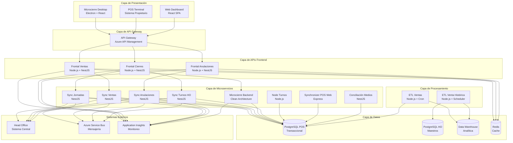
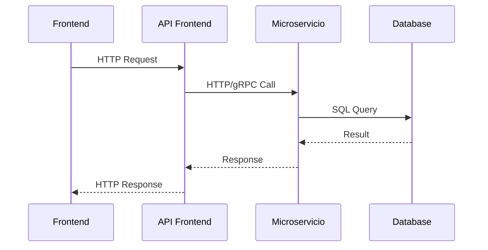
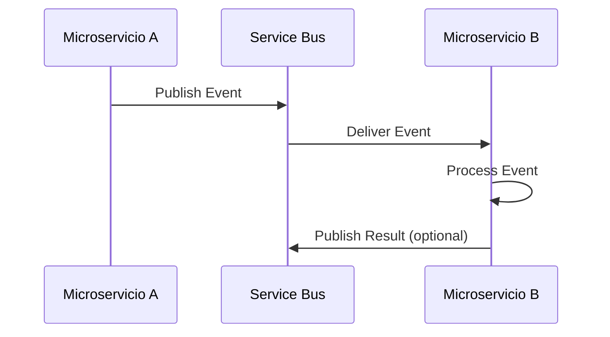

# Diagrama de Componentes

## Arquitectura de Componentes del Sistema

El ecosistema Terpel POS está estructurado en capas bien definidas que permiten escalabilidad, mantenibilidad y separación de responsabilidades.

## Diagrama General de Componentes

## Componentes por Capa

### 🖥️ Capa de Presentación

| Componente | Tecnología | Propósito | Estado |
|------------|------------|-----------|--------|
| **Microcierre Desktop** | Electron + React + TypeScript | Aplicación de escritorio para microcierres | 🟡 65% |
| **POS Terminal** | Sistema Propietario | Terminal punto de venta | 🟢 Estable |
| **Web Dashboard** | React + TypeScript | Dashboard web de monitoreo | 🔴 Planificado |

### 🌐 Capa de APIs Frontend

| Componente | Tecnología | Responsabilidad | Estado |
|------------|------------|-----------------|--------|
| **Frontal Ventas** | Node.js + NestJS | API para consultas y operaciones de ventas | 🟢 85% |
| **Frontal Cierres** | Node.js + NestJS | API para gestión de cierres de turno | 🟢 80% |
| **Frontal Anulaciones** | Node.js + NestJS | API para procesamiento de anulaciones | 🟡 50% |

### ⚙️ Capa de Microservicios

| Componente | Patrón Arquitectónico | Responsabilidad | Estado |
|------------|----------------------|-----------------|--------|
| **Sync Jornadas** | Hexagonal Architecture | Sincronización de jornadas laborales | 🟡 75% |
| **Sync Ventas** | Event-Driven | Sincronización de transacciones de venta | 🟢 85% |
| **Sync Anulaciones** | CQRS | Sincronización de anulaciones | 🟡 80% |
| **Microcierre Backend** | Clean Architecture | Lógica de negocio para microcierres | 🟡 70% |
| **Sync Turnos HO** | Event Sourcing | Sincronización de turnos con HO | 🟡 70% |
| **Node Turnos** | MVC | Gestión local de turnos | 🔴 40% |
| **Synchronizer POS Web** | Layered Architecture | Sincronización POS-Web | 🔴 45% |
| **Conciliación Medios** | Domain-Driven Design | Conciliación de medios de pago | 🔴 40% |

### 📊 Capa de Procesamiento

| Componente | Patrón | Frecuencia | Estado |
|------------|--------|------------|--------|
| **ETL Ventas** | Batch Processing | Tiempo real + Diario | 🟡 60% |
| **ETL Venta Histórica** | Stream Processing | Semanal | 🔴 35% |

### 💾 Capa de Datos

| Componente | Tipo | Propósito | Tecnología |
|------------|------|-----------|------------|
| **PostgreSQL POS** | Transaccional | Datos operacionales POS | PostgreSQL 13+ |
| **PostgreSQL HO** | Maestros | Datos maestros y configuración | PostgreSQL 13+ |
| **Data Warehouse** | Analítica | Datos históricos y reportería | PostgreSQL + TimescaleDB |
| **Redis Cache** | Cache | Cache distribuido y sesiones | Redis 6+ |

## Patrones de Comunicación

### Comunicación Síncrona

### Comunicación Asíncrona

## Dependencias entre Componentes

### Dependencias Críticas
- **APIs Frontend** → **Microservicios**: Dependencia directa para operaciones
- **Microservicios** → **PostgreSQL**: Dependencia crítica para persistencia
- **ETLs** → **Múltiples DBs**: Dependencia para procesamiento de datos
- **Todos los servicios** → **Head Office**: Dependencia externa crítica

### Dependencias Opcionales
- **Microservicios** → **Redis**: Mejora performance pero no crítico
- **Servicios** → **Service Bus**: Mejora resilencia pero no crítico
- **Servicios** → **Monitoring**: Observabilidad pero no funcional

## Escalabilidad por Componente

### Escalabilidad Horizontal
| Componente | Escalable | Método | Limitaciones |
|------------|-----------|--------|--------------|
| **APIs Frontend** | ✅ | Load Balancer + Múltiples instancias | Sesiones stateless |
| **Microservicios** | ✅ | Container orchestration | Base de datos compartida |
| **ETLs** | ✅ | Parallel processing | Orden de procesamiento |
| **Frontend Desktop** | ❌ | N/A | Aplicación local |

### Escalabilidad Vertical
- **PostgreSQL**: Escalable verticalmente hasta cierto punto
- **Redis**: Escalable verticalmente con clustering
- **Microservicios**: Escalables verticalmente por recursos

## Consideraciones de Deployment

### Estrategia por Componente
| Componente | Estrategia | Frecuencia | Rollback |
|------------|------------|------------|----------|
| **APIs Frontend** | Blue-Green | Semanal | Automático |
| **Microservicios** | Rolling Update | Bi-semanal | Manual |
| **ETLs** | Scheduled Deployment | Mensual | Manual |
| **Frontend Desktop** | Client Update | Mensual | Manual |

### Orden de Deployment
1. **Base de Datos** (migraciones)
2. **Microservicios** (backend services)
3. **APIs Frontend** (interfaces)
4. **ETLs** (procesamiento)
5. **Frontend** (aplicaciones cliente)

---

*Diagrama actualizado: Enero 2024*
