# Flujos de Datos

## Visión General

Los flujos de datos en el ecosistema Terpel POS siguen patrones bien definidos que garantizan la consistencia, trazabilidad y performance del sistema. Los datos fluyen desde los puntos de captura (POS) hasta los sistemas de análisis (Data Warehouse) pasando por múltiples capas de procesamiento.

## Flujos Principales

### 1. Flujo de Transacciones de Venta

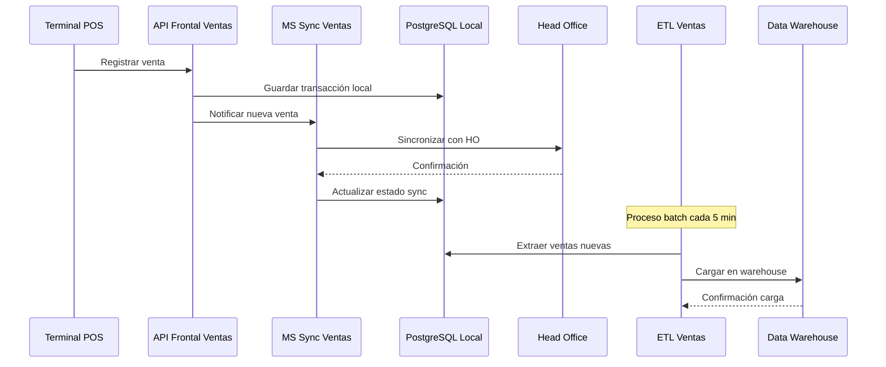

### 2. Flujo de Microcierre

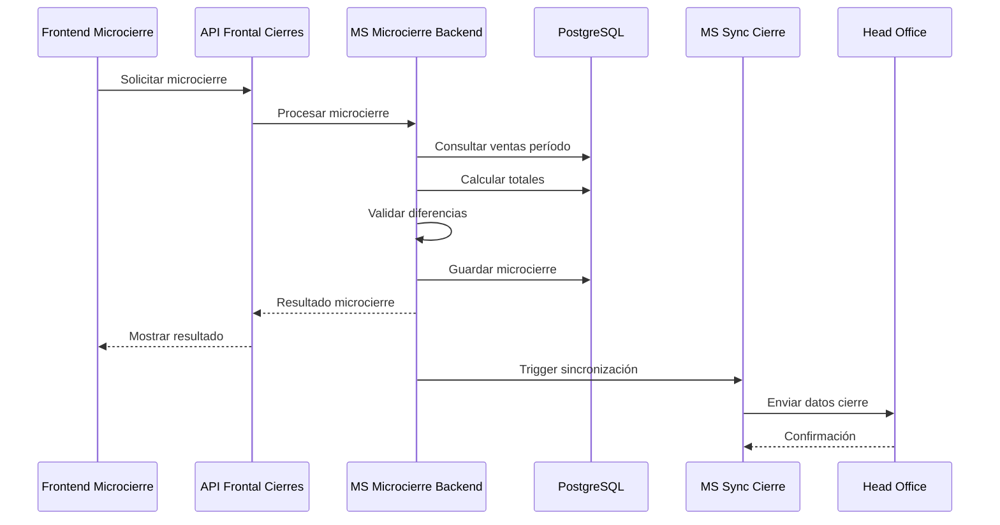

### 3. Flujo de Anulaciones

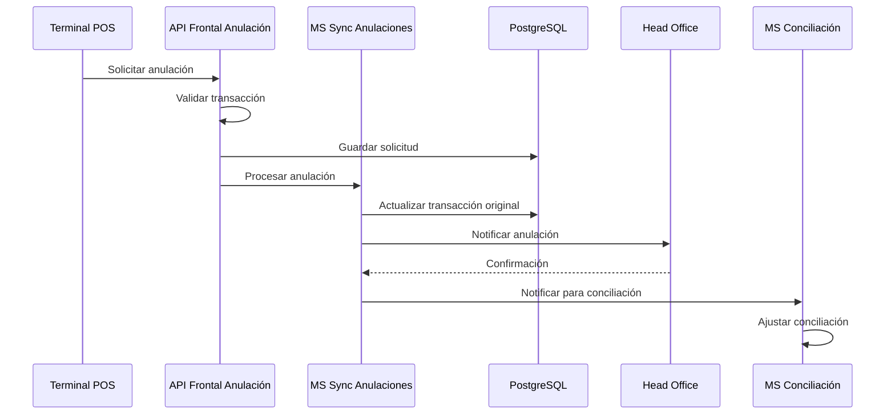

## Patrones de Flujo de Datos

### 1. Patrón Síncrono (Request-Response)

**Uso**: Operaciones críticas que requieren confirmación inmediata
**Ejemplos**: Registro de ventas, validaciones, consultas en tiempo real

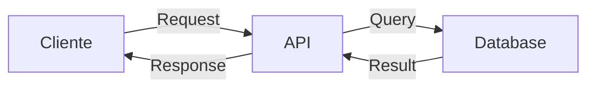

**Características**:
- Latencia baja (< 200ms)
- Consistencia inmediata
- Manejo de errores directo
- Timeout configurado

### 2. Patrón Asíncrono (Event-Driven)

**Uso**: Sincronización con sistemas externos, procesamiento batch
**Ejemplos**: Sincronización HO, ETL, notificaciones

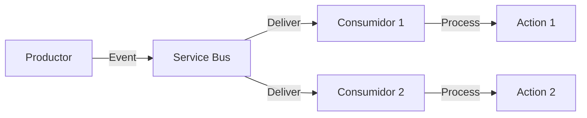

**Características**:
- Desacoplamiento de servicios
- Tolerancia a fallos
- Escalabilidad horizontal
- Eventual consistency

### 3. Patrón ETL (Extract-Transform-Load)

**Uso**: Procesamiento de grandes volúmenes, análisis de datos
**Ejemplos**: Carga a Data Warehouse, reportes históricos

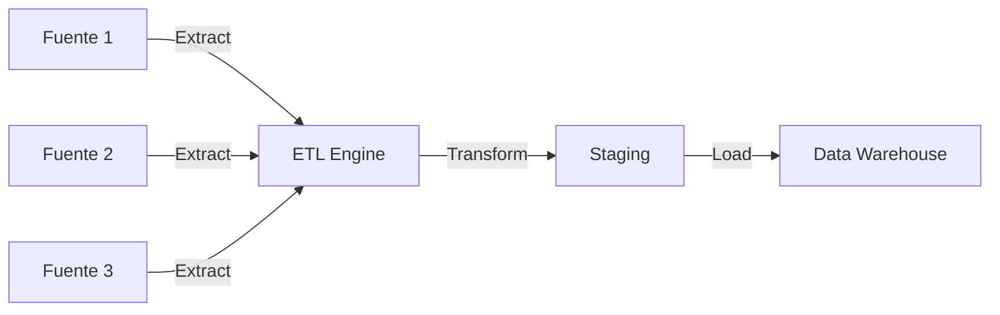

**Características**:
- Procesamiento por lotes
- Transformaciones complejas
- Validación de calidad de datos
- Optimización para volumen

## Flujos por Dominio de Negocio

### Dominio: Gestión de Jornadas

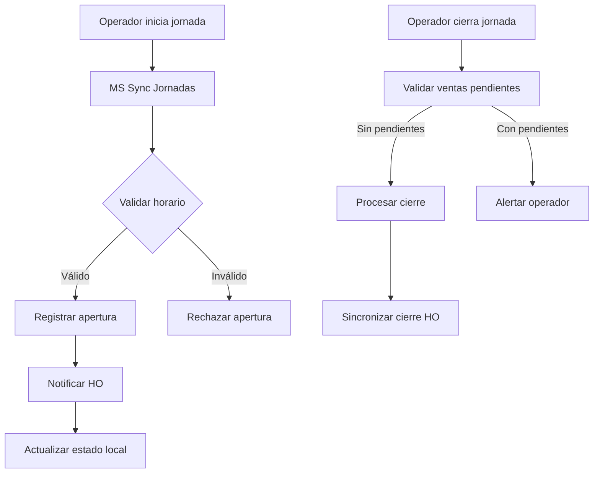

### Dominio: Procesamiento de Pagos

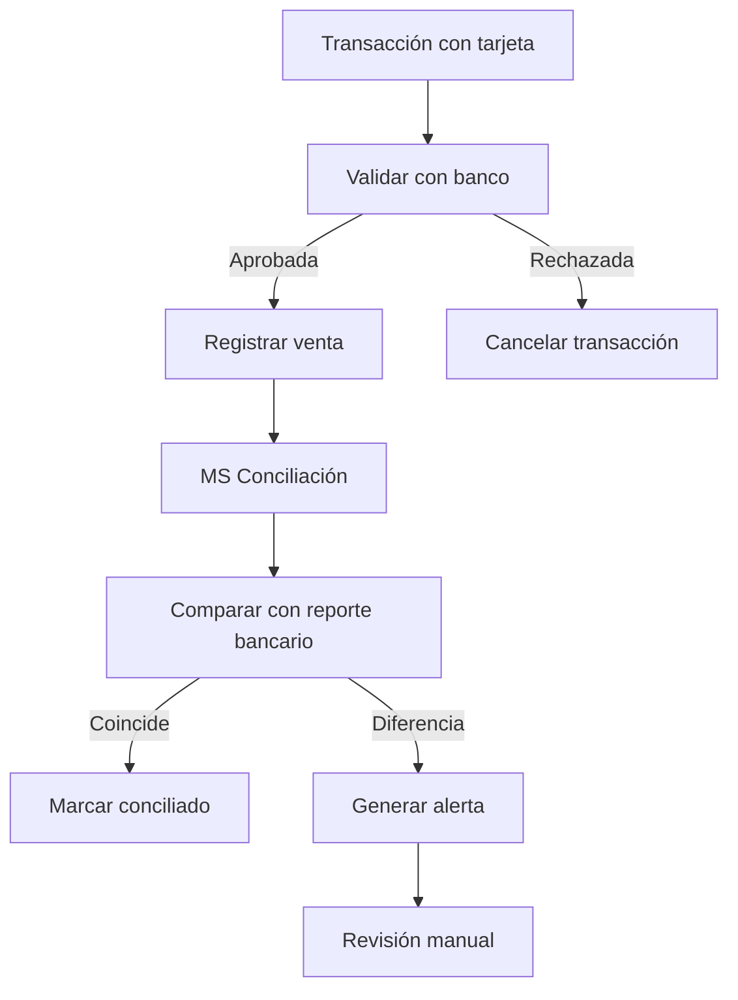

## Calidad de Datos

### Validaciones en Tiempo Real

| Punto de Validación | Reglas | Acción en Error |
|-------------------|--------|-----------------|
| **Entrada POS** | Formato, rangos, obligatorios | Rechazar transacción |
| **API Frontend** | Esquemas JSON, tipos de datos | HTTP 400 Bad Request |
| **Microservicios** | Reglas de negocio | Log error + compensación |
| **ETL** | Integridad referencial | Quarantine + alerta |

### Monitoreo de Calidad

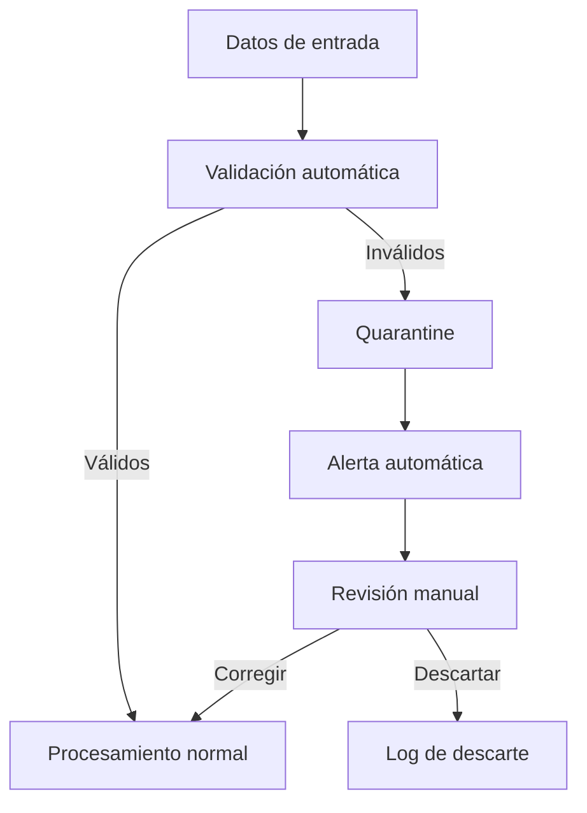

## Performance y Optimización

### Estrategias por Tipo de Flujo

#### Flujos de Alta Frecuencia (Ventas)
- **Cache**: Redis para consultas frecuentes
- **Connection Pooling**: Reutilización de conexiones DB
- **Batch Processing**: Agrupación de operaciones similares
- **Índices**: Optimización de queries frecuentes

#### Flujos de Baja Latencia (Validaciones)
- **In-Memory Processing**: Datos críticos en memoria
- **Circuit Breaker**: Protección contra servicios lentos
- **Timeout Agresivo**: Fallos rápidos
- **Fallback**: Respuestas alternativas

#### Flujos de Alto Volumen (ETL)
- **Parallel Processing**: Procesamiento en paralelo
- **Streaming**: Procesamiento continuo
- **Compression**: Compresión de datos
- **Partitioning**: División de datos por criterios

## Trazabilidad y Auditoría

### Correlation IDs

Cada flujo de datos incluye un ID de correlación único que permite rastrear la transacción a través de todos los servicios.

```json
{
  "correlationId": "550e8400-e29b-41d4-a716-446655440000",
  "timestamp": "2024-01-15T14:30:00Z",
  "service": "ms-sync-ventas",
  "operation": "process-sale",
  "data": { ... }
}
```

### Audit Trail

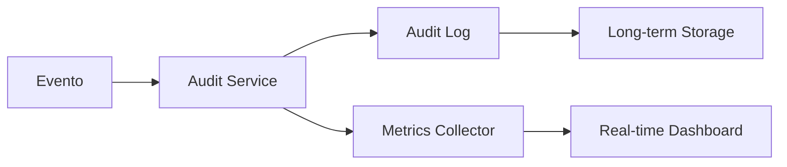

## Manejo de Errores

### Estrategias por Tipo de Error

| Tipo de Error | Estrategia | Ejemplo |
|---------------|------------|---------|
| **Transient** | Retry con backoff | Timeout de red |
| **Business** | Compensación | Saldo insuficiente |
| **System** | Circuit breaker | Servicio no disponible |
| **Data** | Quarantine | Formato inválido |

### Dead Letter Queue

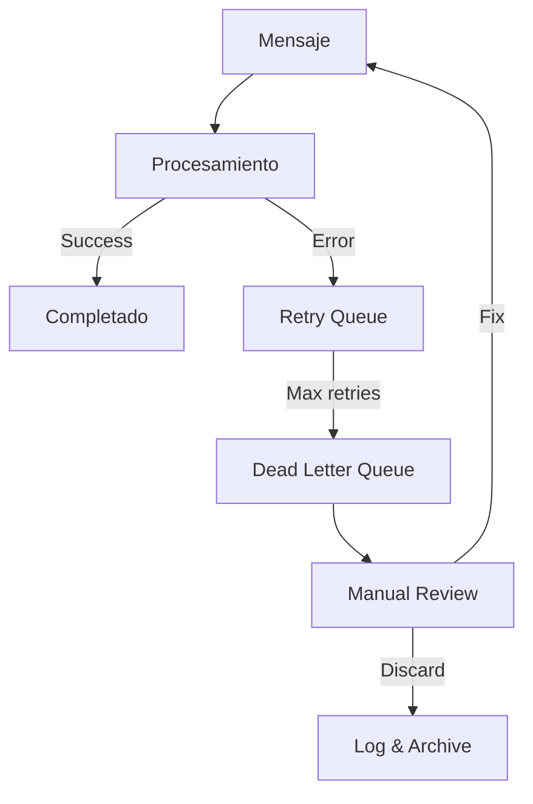

## Métricas y Monitoreo

### KPIs de Flujo de Datos

| Métrica | Objetivo | Alerta |
|---------|----------|--------|
| **Throughput** | > 1000 TPS | < 500 TPS |
| **Latency P95** | < 200ms | > 500ms |
| **Error Rate** | < 0.1% | > 1% |
| **Data Quality** | > 99.9% | < 99% |

### Dashboard de Flujos

- **Tiempo real**: Volumen actual, latencia, errores
- **Histórico**: Tendencias, patrones, comparativas
- **Alertas**: Umbrales, anomalías, fallos críticos
- **Trazabilidad**: Seguimiento end-to-end de transacciones

---

*Flujos documentados: Enero 2024*
