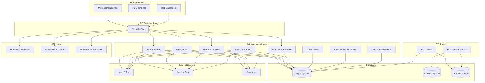
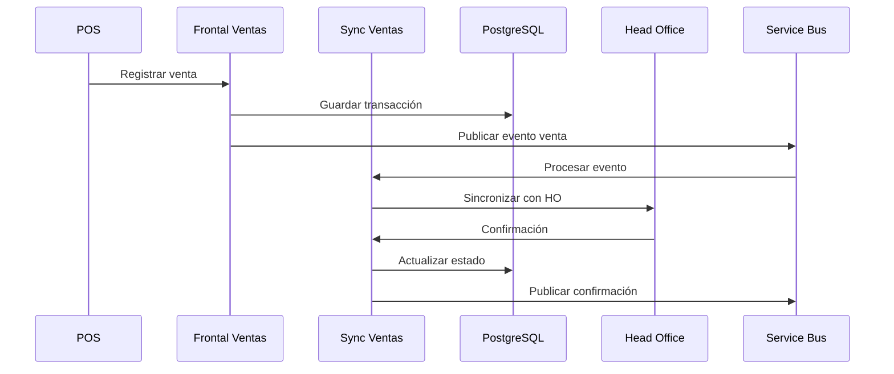
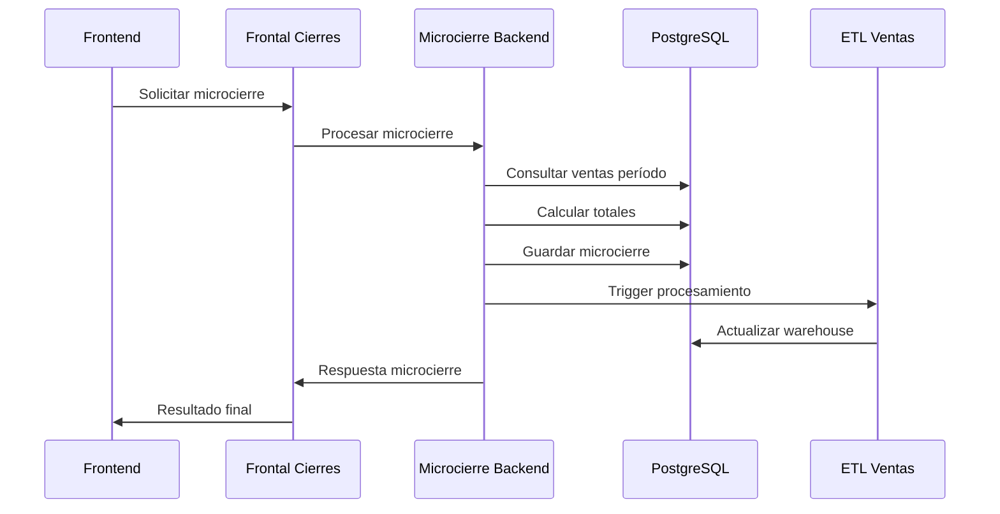

# Visión General de la Arquitectura

## Introducción

El ecosistema Terpel POS está diseñado como una arquitectura de microservicios distribuida que gestiona todas las operaciones de punto de venta en las estaciones de servicio. La arquitectura sigue principios de diseño moderno, incluyendo separación de responsabilidades, escalabilidad horizontal y alta disponibilidad.

## Principios Arquitectónicos

### 1. Microservicios
- **Separación de responsabilidades**: Cada servicio tiene una responsabilidad específica
- **Independencia de despliegue**: Los servicios se pueden desplegar independientemente
- **Tecnología agnóstica**: Cada servicio puede usar la tecnología más apropiada
- **Escalabilidad granular**: Escalar solo los componentes que lo necesiten

### 2. Event-Driven Architecture
- **Comunicación asíncrona**: Uso de Service Bus para eventos
- **Desacoplamiento**: Los servicios no dependen directamente unos de otros
- **Resiliencia**: Tolerancia a fallos de servicios individuales
- **Auditabilidad**: Trazabilidad completa de eventos

### 3. API-First Design
- **Contratos claros**: APIs bien definidas entre servicios
- **Versionado**: Manejo de versiones de API
- **Documentación**: OpenAPI/Swagger para todas las APIs
- **Testing**: APIs testeable de forma independiente

## Arquitectura de Alto Nivel

## Componentes del Sistema

### Frontend Applications
| Componente | Tecnología | Propósito |
|------------|------------|-----------|
| Microcierre Desktop | Electron + React | Aplicación de escritorio para microcierres |
| POS Terminal | Propietario | Terminal de punto de venta |
| Web Dashboard | React | Dashboard web para monitoreo |

### Microservicios Core
| Servicio | Responsabilidad | Base de Datos |
|----------|----------------|---------------|
| Sync Jornadas | Sincronización de jornadas laborales | PostgreSQL |
| Sync Ventas | Sincronización de transacciones de venta | PostgreSQL |
| Sync Anulaciones | Sincronización de anulaciones | PostgreSQL |
| Microcierre Backend | Procesamiento de microcierres | PostgreSQL |
| Sync Turnos HO | Sincronización de turnos con HO | PostgreSQL |
| Node Turnos | Gestión de turnos locales | PostgreSQL |
| Synchronizer POS Web | Sincronización web-POS | PostgreSQL |
| Conciliación Medios | Conciliación de medios de pago | PostgreSQL |

### ETL Services
| Servicio | Fuente | Destino | Frecuencia |
|----------|--------|---------|-----------|
| ETL Ventas | PostgreSQL POS | Data Warehouse | Tiempo real |
| ETL Venta Histórica | Head Office | Data Warehouse | Diario |

### API Services
| API | Propósito | Consumidores |
|-----|-----------|--------------|
| Frontal Node Ventas | API para consultas de ventas | Frontend, Reportes |
| Frontal Node Cierres | API para gestión de cierres | Frontend, Microcierre |
| Frontal Node Anulación | API para anulaciones | Frontend, POS |

## Patrones de Diseño Implementados

### 1. CQRS (Command Query Responsibility Segregation)
- **Commands**: Operaciones de escritura (ventas, cierres, anulaciones)
- **Queries**: Operaciones de lectura (consultas, reportes)
- **Beneficios**: Optimización independiente, escalabilidad diferenciada

### 2. Event Sourcing
- **Event Store**: Almacenamiento de eventos de dominio
- **Projections**: Vistas materializadas para consultas
- **Replay**: Capacidad de reconstruir estado desde eventos

### 3. Saga Pattern
- **Transacciones distribuidas**: Coordinación de operaciones multi-servicio
- **Compensación**: Rollback de operaciones en caso de fallo
- **Orquestación**: Control centralizado de flujos complejos

### 4. Circuit Breaker
- **Protección**: Prevención de cascada de fallos
- **Recuperación**: Detección automática de servicios recuperados
- **Fallback**: Respuestas alternativas en caso de fallo

## Flujos de Datos Principales

### 1. Flujo de Venta

### 2. Flujo de Microcierre

## Estrategias de Datos

### 1. Database per Service
- **Aislamiento**: Cada microservicio tiene su propia base de datos
- **Autonomía**: Equipos pueden evolucionar esquemas independientemente
- **Tecnología**: Elección de tecnología de datos apropiada por servicio

### 2. Data Consistency
- **Eventual Consistency**: Consistencia eventual entre servicios
- **Compensating Actions**: Acciones de compensación para rollback
- **Idempotency**: Operaciones idempotentes para reintentos seguros

### 3. Data Synchronization
- **Change Data Capture**: Captura de cambios en tiempo real
- **Event Streaming**: Streaming de eventos de datos
- **Batch Processing**: Procesamiento por lotes para datos históricos

## Consideraciones de Seguridad

### 1. Autenticación y Autorización
- **JWT Tokens**: Tokens para autenticación de servicios
- **OAuth 2.0**: Protocolo de autorización estándar
- **RBAC**: Control de acceso basado en roles

### 2. Comunicación Segura
- **TLS/SSL**: Encriptación en tránsito
- **mTLS**: Autenticación mutua entre servicios
- **API Keys**: Claves de API para servicios externos

### 3. Datos Sensibles
- **Encryption at Rest**: Encriptación de datos en reposo
- **PII Protection**: Protección de información personal
- **Audit Logging**: Logging de auditoría completo

## Monitoreo y Observabilidad

### 1. Logging
- **Structured Logging**: Logs estructurados en JSON
- **Correlation IDs**: IDs de correlación para trazabilidad
- **Centralized Logging**: Agregación centralizada de logs

### 2. Métricas
- **Business Metrics**: Métricas de negocio (ventas, transacciones)
- **Technical Metrics**: Métricas técnicas (latencia, errores)
- **Infrastructure Metrics**: Métricas de infraestructura

### 3. Tracing
- **Distributed Tracing**: Trazabilidad distribuida
- **Performance Monitoring**: Monitoreo de rendimiento
- **Error Tracking**: Seguimiento de errores

## Escalabilidad y Performance

### 1. Horizontal Scaling
- **Load Balancing**: Balanceadores de carga
- **Auto Scaling**: Escalado automático basado en métricas
- **Container Orchestration**: Orquestación con Kubernetes

### 2. Caching
- **Application Cache**: Cache a nivel de aplicación
- **Distributed Cache**: Cache distribuido (Redis)
- **CDN**: Content Delivery Network para assets estáticos

### 3. Database Optimization
- **Read Replicas**: Réplicas de lectura
- **Partitioning**: Particionado de tablas
- **Indexing**: Índices optimizados

## Disaster Recovery

### 1. Backup Strategy
- **Automated Backups**: Backups automáticos regulares
- **Cross-Region Replication**: Replicación entre regiones
- **Point-in-Time Recovery**: Recuperación a punto en el tiempo

### 2. High Availability
- **Multi-AZ Deployment**: Despliegue multi-zona
- **Failover Mechanisms**: Mecanismos de failover automático
- **Health Checks**: Verificaciones de salud continuas

### 3. Business Continuity
- **Offline Capabilities**: Capacidades offline críticas
- **Data Synchronization**: Sincronización al recuperar conectividad
- **Manual Procedures**: Procedimientos manuales de contingencia

## Roadmap Arquitectónico

### Corto Plazo (3-6 meses)
- [ ] Implementar API Gateway
- [ ] Centralizar logging y monitoreo
- [ ] Implementar circuit breakers
- [ ] Optimizar bases de datos

### Mediano Plazo (6-12 meses)
- [ ] Migrar a contenedores
- [ ] Implementar service mesh
- [ ] Agregar cache distribuido
- [ ] Mejorar observabilidad

### Largo Plazo (12+ meses)
- [ ] Adoptar event sourcing completo
- [ ] Implementar ML/AI para predicciones
- [ ] Migrar a cloud-native
- [ ] Automatización completa de operaciones
