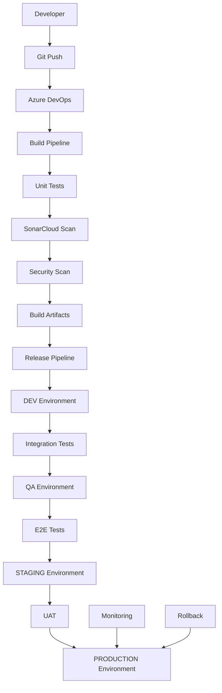
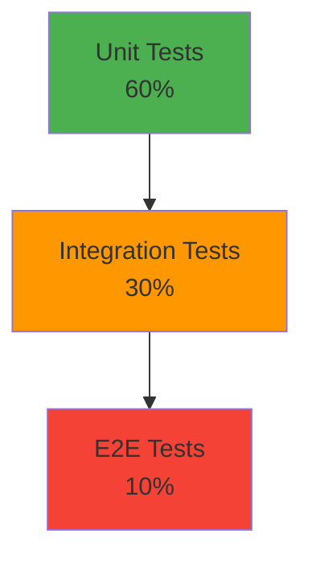

# CI/CD y Estrategia de Despliegue

## Visión General

El ecosistema Terpel POS implementa una estrategia de CI/CD robusta utilizando Azure DevOps, con pipelines automatizados para build, test, security scanning y deployment. Cada microservicio y componente tiene su propio pipeline independiente, permitiendo despliegues autónomos y frecuentes.

## Arquitectura CI/CD



## Estrategia de Branching

### GitFlow Adaptado
```
main (production)
├── develop (integration)
│   ├── feature/ms-sync-ventas-v2
│   ├── feature/frontend-ui-improvements
│   └── feature/etl-performance-optimization
├── release/v1.2.0
├── hotfix/critical-bug-fix
└── support/v1.1.x
```

### Políticas de Branch
| Branch | Propósito | Protección | Auto-merge |
|--------|-----------|------------|------------|
| `main` | Producción | ✅ Required PR + 2 approvals | ❌ |
| `develop` | Integración | ✅ Required PR + 1 approval | ✅ |
| `feature/*` | Desarrollo | ✅ Required PR | ✅ |
| `release/*` | Release prep | ✅ Required PR + 2 approvals | ❌ |
| `hotfix/*` | Fixes críticos | ✅ Required PR + 1 approval | ❌ |

## Pipelines de Build

### Pipeline Template Base
```yaml
# azure-pipelines-template.yml
parameters:
  - name: serviceName
    type: string
  - name: nodeVersion
    type: string
    default: '18.17.1'
  - name: testCommand
    type: string
    default: 'yarn test'

stages:
  - stage: Build
    displayName: 'Build and Test'
    jobs:
      - job: BuildJob
        displayName: 'Build $(parameters.serviceName)'
        pool:
          vmImage: 'ubuntu-latest'
        
        steps:
          - task: NodeTool@0
            displayName: 'Use Node.js $(parameters.nodeVersion)'
            inputs:
              versionSpec: '$(parameters.nodeVersion)'
          
          - task: Cache@2
            displayName: 'Cache node_modules'
            inputs:
              key: 'yarn | "$(Agent.OS)" | yarn.lock'
              restoreKeys: |
                yarn | "$(Agent.OS)"
              path: 'node_modules'
          
          - script: |
              yarn install --frozen-lockfile
            displayName: 'Install dependencies'
          
          - script: |
              yarn lint
            displayName: 'Run linting'
          
          - script: |
              $(parameters.testCommand)
            displayName: 'Run tests'
          
          - task: PublishTestResults@2
            displayName: 'Publish test results'
            inputs:
              testResultsFormat: 'JUnit'
              testResultsFiles: '**/test-results.xml'
              mergeTestResults: true
          
          - task: PublishCodeCoverageResults@1
            displayName: 'Publish code coverage'
            inputs:
              codeCoverageTool: 'Cobertura'
              summaryFileLocation: '**/coverage/cobertura-coverage.xml'
          
          - script: |
              yarn build
            displayName: 'Build application'
          
          - task: PublishBuildArtifacts@1
            displayName: 'Publish build artifacts'
            inputs:
              pathToPublish: 'dist'
              artifactName: '$(parameters.serviceName)-$(Build.BuildNumber)'
```

### Pipeline Específico por Servicio
```yaml
# ap31tpt-terpelpos-transicion-ms-pos-sincronizacion-ventas/azure-pipelines.yml
trigger:
  branches:
    include:
      - main
      - develop
  paths:
    include:
      - ap31tpt-terpelpos-transicion-ms-pos-sincronizacion-ventas/*

variables:
  serviceName: 'ms-pos-sincronizacion-ventas'
  dockerImageName: 'terpel/pos-sync-ventas'
  
extends:
  template: ../azure-pipelines-template.yml
  parameters:
    serviceName: $(serviceName)
    nodeVersion: '18.17.1'
    testCommand: 'yarn test:ci'

stages:
  - stage: SecurityScan
    displayName: 'Security Analysis'
    dependsOn: Build
    jobs:
      - job: SonarCloud
        displayName: 'SonarCloud Analysis'
        steps:
          - task: SonarCloudPrepare@1
            inputs:
              SonarCloud: 'SonarCloud-Terpel'
              organization: 'terpel-pos'
              scannerMode: 'CLI'
              configMode: 'manual'
              cliProjectKey: 'terpel-pos_$(serviceName)'
              cliProjectName: '$(serviceName)'
              cliSources: 'src'
              extraProperties: |
                sonar.typescript.lcov.reportPaths=coverage/lcov.info
                sonar.exclusions=**/*.spec.ts,**/*.test.ts,**/node_modules/**
          
          - task: SonarCloudAnalyze@1
          
          - task: SonarCloudPublish@1
            inputs:
              pollingTimeoutSec: '300'
      
      - job: SecurityScan
        displayName: 'Security Vulnerability Scan'
        steps:
          - script: |
              yarn audit --level high
            displayName: 'NPM Security Audit'
          
          - task: WhiteSource@21
            displayName: 'WhiteSource Security Scan'
            inputs:
              cwd: '$(System.DefaultWorkingDirectory)'

  - stage: Docker
    displayName: 'Docker Build and Push'
    dependsOn: SecurityScan
    condition: and(succeeded(), eq(variables['Build.SourceBranch'], 'refs/heads/main'))
    jobs:
      - job: DockerBuild
        displayName: 'Build and Push Docker Image'
        steps:
          - task: Docker@2
            displayName: 'Build Docker image'
            inputs:
              command: 'build'
              dockerfile: 'Dockerfile'
              tags: |
                $(dockerImageName):$(Build.BuildNumber)
                $(dockerImageName):latest
          
          - task: Docker@2
            displayName: 'Push Docker image'
            inputs:
              command: 'push'
              containerRegistry: 'TerpelACR'
              repository: '$(dockerImageName)'
              tags: |
                $(Build.BuildNumber)
                latest
```

## Estrategia de Testing

### Pirámide de Testing


### Configuración de Tests
```json
// jest.config.js
module.exports = {
  preset: 'ts-jest',
  testEnvironment: 'node',
  roots: ['<rootDir>/src', '<rootDir>/test'],
  testMatch: [
    '**/__tests__/**/*.ts',
    '**/?(*.)+(spec|test).ts'
  ],
  collectCoverageFrom: [
    'src/**/*.ts',
    '!src/**/*.d.ts',
    '!src/**/*.interface.ts',
    '!src/main.ts'
  ],
  coverageThreshold: {
    global: {
      branches: 80,
      functions: 80,
      lines: 80,
      statements: 80
    }
  },
  coverageReporters: ['text', 'lcov', 'cobertura'],
  setupFilesAfterEnv: ['<rootDir>/test/setup.ts']
};
```

### Tests de Integración
```typescript
// test/integration/sales-sync.integration.spec.ts
describe('Sales Sync Integration', () => {
  let app: INestApplication;
  let salesService: SalesService;
  
  beforeAll(async () => {
    const moduleFixture = await Test.createTestingModule({
      imports: [AppModule],
    })
    .overrideProvider(DatabaseService)
    .useValue(mockDatabaseService)
    .compile();

    app = moduleFixture.createNestApplication();
    salesService = moduleFixture.get<SalesService>(SalesService);
    await app.init();
  });

  it('should sync sales transaction successfully', async () => {
    const saleData = {
      transactionId: 'TXN-TEST-001',
      stationId: 'EST-001',
      total: 100000
    };

    const result = await request(app.getHttpServer())
      .post('/sales/sync')
      .send(saleData)
      .expect(201);

    expect(result.body.syncId).toBeDefined();
    expect(result.body.status).toBe('PENDING');
  });
});
```

## Ambientes de Despliegue

### Configuración de Ambientes
| Ambiente | Propósito | Auto-deploy | Approval | Retention |
|----------|-----------|-------------|----------|-----------|
| **DEV** | Desarrollo continuo | ✅ develop branch | ❌ | 7 días |
| **QA** | Testing funcional | ✅ después de DEV | ❌ | 14 días |
| **STAGING** | Pre-producción | ✅ después de QA | ✅ QA Lead | 30 días |
| **PROD** | Producción | ❌ Manual | ✅ Tech Lead + PO | Permanente |

### Variables por Ambiente
```yaml
# Variable Groups en Azure DevOps
variables:
  - group: 'terpel-pos-dev'
    variables:
      DB_HOST: 'dev-postgres.terpel.com'
      API_URL: 'https://dev-api.terpel.com'
      LOG_LEVEL: 'debug'
  
  - group: 'terpel-pos-qa'
    variables:
      DB_HOST: 'qa-postgres.terpel.com'
      API_URL: 'https://qa-api.terpel.com'
      LOG_LEVEL: 'info'
  
  - group: 'terpel-pos-prod'
    variables:
      DB_HOST: 'prod-postgres.terpel.com'
      API_URL: 'https://api.terpel.com'
      LOG_LEVEL: 'warn'
```

## Release Pipeline

### Release Strategy
```yaml
# release-pipeline.yml
stages:
  - stage: DeployDev
    displayName: 'Deploy to DEV'
    condition: eq(variables['Build.SourceBranch'], 'refs/heads/develop')
    jobs:
      - deployment: DeployDevJob
        displayName: 'Deploy to DEV Environment'
        environment: 'terpel-pos-dev'
        strategy:
          runOnce:
            deploy:
              steps:
                - template: deploy-steps.yml
                  parameters:
                    environment: 'dev'
                    serviceConnection: 'Azure-DEV'

  - stage: DeployQA
    displayName: 'Deploy to QA'
    dependsOn: DeployDev
    condition: succeeded()
    jobs:
      - deployment: DeployQAJob
        displayName: 'Deploy to QA Environment'
        environment: 'terpel-pos-qa'
        strategy:
          runOnce:
            deploy:
              steps:
                - template: deploy-steps.yml
                  parameters:
                    environment: 'qa'
                    serviceConnection: 'Azure-QA'
                - template: integration-tests.yml

  - stage: DeployStaging
    displayName: 'Deploy to STAGING'
    dependsOn: DeployQA
    condition: and(succeeded(), eq(variables['Build.SourceBranch'], 'refs/heads/main'))
    jobs:
      - deployment: DeployStagingJob
        displayName: 'Deploy to STAGING Environment'
        environment: 'terpel-pos-staging'
        strategy:
          runOnce:
            deploy:
              steps:
                - template: deploy-steps.yml
                  parameters:
                    environment: 'staging'
                    serviceConnection: 'Azure-STAGING'
                - template: e2e-tests.yml

  - stage: DeployProduction
    displayName: 'Deploy to PRODUCTION'
    dependsOn: DeployStaging
    condition: and(succeeded(), eq(variables['Build.SourceBranch'], 'refs/heads/main'))
    jobs:
      - deployment: DeployProdJob
        displayName: 'Deploy to PRODUCTION Environment'
        environment: 'terpel-pos-production'
        strategy:
          canary:
            increments: [25, 50, 100]
            deploy:
              steps:
                - template: deploy-steps.yml
                  parameters:
                    environment: 'prod'
                    serviceConnection: 'Azure-PROD'
                - template: health-checks.yml
```

### Deploy Steps Template
```yaml
# deploy-steps.yml
parameters:
  - name: environment
    type: string
  - name: serviceConnection
    type: string

steps:
  - task: AzureWebApp@1
    displayName: 'Deploy to Azure App Service'
    inputs:
      azureSubscription: '${{ parameters.serviceConnection }}'
      appType: 'webAppLinux'
      appName: 'terpel-pos-$(serviceName)-${{ parameters.environment }}'
      package: '$(Pipeline.Workspace)/drop/$(serviceName)-$(Build.BuildNumber).zip'
      runtimeStack: 'NODE|18-lts'
      startUpCommand: 'yarn start:prod'

  - task: AzureCLI@2
    displayName: 'Update App Settings'
    inputs:
      azureSubscription: '${{ parameters.serviceConnection }}'
      scriptType: 'bash'
      scriptLocation: 'inlineScript'
      inlineScript: |
        az webapp config appsettings set \
          --resource-group terpel-pos-${{ parameters.environment }} \
          --name terpel-pos-$(serviceName)-${{ parameters.environment }} \
          --settings \
            NODE_ENV=${{ parameters.environment }} \
            BUILD_NUMBER=$(Build.BuildNumber) \
            DEPLOYMENT_TIME=$(date -u +"%Y-%m-%dT%H:%M:%SZ")

  - task: AzureAppServiceManage@0
    displayName: 'Restart App Service'
    inputs:
      azureSubscription: '${{ parameters.serviceConnection }}'
      action: 'Restart Azure App Service'
      webAppName: 'terpel-pos-$(serviceName)-${{ parameters.environment }}'
```

## Monitoreo de Deployments

### Health Checks
```typescript
// src/health/health.controller.ts
@Controller('health')
export class HealthController {
  constructor(
    private readonly healthCheckService: HealthCheckService,
    private readonly databaseHealthIndicator: DatabaseHealthIndicator,
    private readonly httpHealthIndicator: HttpHealthIndicator,
  ) {}

  @Get()
  @HealthCheck()
  check() {
    return this.healthCheckService.check([
      () => this.databaseHealthIndicator.pingCheck('database'),
      () => this.httpHealthIndicator.pingCheck('head-office', 'https://api.headoffice.terpel.com/health'),
    ]);
  }

  @Get('ready')
  @HealthCheck()
  readiness() {
    return this.healthCheckService.check([
      () => this.databaseHealthIndicator.isHealthy('database'),
    ]);
  }

  @Get('live')
  @HealthCheck()
  liveness() {
    return { status: 'ok', timestamp: new Date().toISOString() };
  }
}
```

### Smoke Tests Post-Deploy
```yaml
# smoke-tests.yml
steps:
  - task: PowerShell@2
    displayName: 'Run Smoke Tests'
    inputs:
      targetType: 'inline'
      script: |
        $baseUrl = "https://terpel-pos-$(serviceName)-$(environment).azurewebsites.net"
        
        # Health check
        $healthResponse = Invoke-RestMethod -Uri "$baseUrl/health" -Method Get
        if ($healthResponse.status -ne "ok") {
          throw "Health check failed"
        }
        
        # API availability
        $apiResponse = Invoke-RestMethod -Uri "$baseUrl/api/status" -Method Get
        if ($apiResponse.status -ne "available") {
          throw "API not available"
        }
        
        Write-Host "Smoke tests passed successfully"
```

## Rollback Strategy

### Automated Rollback
```yaml
# rollback-pipeline.yml
parameters:
  - name: targetVersion
    displayName: 'Target Version to Rollback'
    type: string
  - name: environment
    displayName: 'Environment'
    type: string
    values:
      - staging
      - production

stages:
  - stage: Rollback
    displayName: 'Rollback to ${{ parameters.targetVersion }}'
    jobs:
      - job: RollbackJob
        displayName: 'Execute Rollback'
        steps:
          - task: AzureAppServiceManage@0
            displayName: 'Stop App Service'
            inputs:
              azureSubscription: 'Azure-${{ upper(parameters.environment) }}'
              action: 'Stop Azure App Service'
              webAppName: 'terpel-pos-$(serviceName)-${{ parameters.environment }}'
          
          - task: AzureRmWebAppDeployment@4
            displayName: 'Deploy Previous Version'
            inputs:
              azureSubscription: 'Azure-${{ upper(parameters.environment) }}'
              appType: 'webAppLinux'
              webAppName: 'terpel-pos-$(serviceName)-${{ parameters.environment }}'
              package: '$(Pipeline.Workspace)/artifacts/${{ parameters.targetVersion }}.zip'
          
          - task: AzureAppServiceManage@0
            displayName: 'Start App Service'
            inputs:
              azureSubscription: 'Azure-${{ upper(parameters.environment) }}'
              action: 'Start Azure App Service'
              webAppName: 'terpel-pos-$(serviceName)-${{ parameters.environment }}'
          
          - template: health-checks.yml
            parameters:
              environment: ${{ parameters.environment }}
```

## Métricas y Alertas

### Deployment Metrics
```yaml
# deployment-metrics.yml
steps:
  - task: AzureCLI@2
    displayName: 'Send Deployment Metrics'
    inputs:
      azureSubscription: 'Azure-Monitoring'
      scriptType: 'bash'
      scriptLocation: 'inlineScript'
      inlineScript: |
        # Send custom metrics to Application Insights
        curl -X POST \
          -H "Content-Type: application/json" \
          -d '{
            "name": "deployment.completed",
            "value": 1,
            "properties": {
              "service": "$(serviceName)",
              "environment": "$(environment)",
              "version": "$(Build.BuildNumber)",
              "duration": "$(deploymentDuration)"
            }
          }' \
          "https://dc.services.visualstudio.com/v2/track"
```

### Alertas de Deployment
- **Deployment Failed**: Notificación inmediata a equipo
- **Health Check Failed**: Rollback automático después de 3 fallos
- **Performance Degradation**: Alerta si latencia aumenta >50%
- **Error Rate Spike**: Alerta si error rate >5%

## Configuración de Seguridad

### Secrets Management
```yaml
# Uso de Azure Key Vault
variables:
  - group: 'terpel-pos-secrets'
    
steps:
  - task: AzureKeyVault@2
    displayName: 'Get secrets from Key Vault'
    inputs:
      azureSubscription: 'Azure-KeyVault'
      keyVaultName: 'terpel-pos-kv-$(environment)'
      secretsFilter: 'db-password,api-key,jwt-secret'
      runAsPreJob: true
```

### Security Scanning
- **SonarCloud**: Análisis estático de código
- **WhiteSource**: Vulnerabilidades en dependencias
- **Container Scanning**: Vulnerabilidades en imágenes Docker
- **OWASP ZAP**: Security testing automatizado

## Best Practices

### Pipeline Optimization
1. **Parallel Jobs**: Ejecutar tests y builds en paralelo
2. **Caching**: Cache de node_modules y artifacts
3. **Incremental Builds**: Solo build de componentes modificados
4. **Artifact Management**: Limpieza automática de artifacts antiguos

### Quality Gates
1. **Code Coverage**: Mínimo 80% cobertura
2. **Security Rating**: Rating A en SonarCloud
3. **Performance**: Tests de performance en staging
4. **Manual Approval**: Aprobación manual para producción

### Monitoring
1. **Pipeline Duration**: Alertas si pipeline toma >30min
2. **Success Rate**: Monitoreo de tasa de éxito
3. **Deployment Frequency**: Métricas de frecuencia de deploy
4. **Lead Time**: Tiempo desde commit hasta producción

---

*Última actualización: Enero 2024*
*Mantenido por: DevOps Team*
