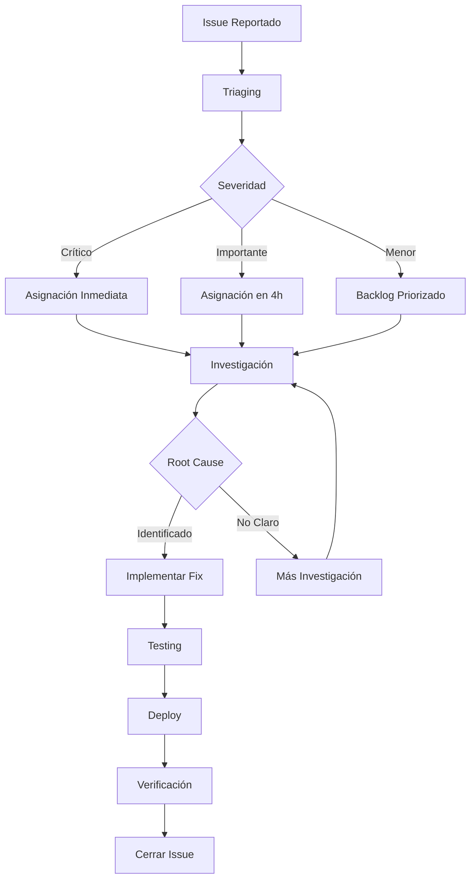

# Issues Conocidos

## Issues Críticos 🔴

### ISS-001: Performance degradation en MS Sync Ventas
**Estado**: 🔴 Crítico  
**Fecha**: 2024-01-10  
**Componente**: ms-pos-sincronizacion-sales  

**Descripción**: Degradación significativa de performance cuando el volumen de transacciones supera las 500 TPS.

**Síntomas**:
- Latencia aumenta de 200ms a 2000ms
- Memory leaks en procesamiento batch
- Timeouts en conexiones a Head Office

**Impacto**: Alto - Afecta sincronización en tiempo real  
**Workaround**: Reducir batch size a 50 transacciones  
**ETA Fix**: 2024-01-25  

**Acciones**:
- [ ] Optimizar queries de base de datos
- [ ] Implementar connection pooling mejorado
- [ ] Agregar circuit breaker para HO API
- [x] Implementar workaround temporal

---

### ISS-002: Inconsistencias en conciliación de medios de pago
**Estado**: 🔴 Crítico  
**Fecha**: 2024-01-12  
**Componente**: ms-conciliacion-medios-pago  

**Descripción**: Diferencias no identificadas entre reportes POS y bancarios.

**Síntomas**:
- Diferencias de hasta $50,000 diarios
- Transacciones duplicadas en algunos casos
- Falsos positivos en matching automático

**Impacto**: Alto - Afecta reconciliación contable  
**Workaround**: Revisión manual diaria  
**ETA Fix**: 2024-02-05  

**Acciones**:
- [ ] Revisar algoritmo de matching
- [ ] Implementar validación de duplicados
- [ ] Mejorar logging para auditoría
- [ ] Crear dashboard de monitoreo

---

## Issues Importantes 🟡

### ISS-003: Memory leaks en Frontend Microcierre
**Estado**: 🟡 Importante  
**Fecha**: 2024-01-08  
**Componente**: ft-pos-microcierrefront  

**Descripción**: Aplicación Electron consume memoria progresivamente hasta crash.

**Síntomas**:
- Uso de memoria aumenta 50MB/hora
- Aplicación se vuelve lenta después de 4 horas
- Crash después de 8 horas de uso continuo

**Impacto**: Medio - Requiere reinicio periódico  
**Workaround**: Reiniciar aplicación cada 6 horas  
**ETA Fix**: 2024-01-30  

**Acciones**:
- [ ] Identificar componentes con memory leaks
- [ ] Implementar cleanup automático
- [ ] Agregar monitoreo de memoria
- [x] Documentar workaround

---

### ISS-004: Timeouts intermitentes con Head Office
**Estado**: 🟡 Importante  
**Fecha**: 2024-01-14  
**Componente**: Múltiples microservicios  

**Descripción**: Timeouts aleatorios en llamadas a APIs de Head Office.

**Síntomas**:
- 5-10% de requests fallan con timeout
- Más frecuente en horas pico (8-10 AM, 6-8 PM)
- Afecta principalmente sincronización de ventas

**Impacto**: Medio - Datos se sincronizan con retraso  
**Workaround**: Retry automático con backoff exponencial  
**ETA Fix**: 2024-02-15 (depende de Head Office)  

**Acciones**:
- [x] Implementar retry con backoff
- [ ] Coordinar con equipo Head Office
- [ ] Implementar circuit breaker
- [ ] Agregar métricas de latencia HO

---

### ISS-005: Validaciones de negocio inconsistentes
**Estado**: 🟡 Importante  
**Fecha**: 2024-01-11  
**Componente**: ms-pos-sincronizacion-anulaciones  

**Descripción**: Reglas de validación para anulaciones no están alineadas entre POS y sistema central.

**Síntomas**:
- Anulaciones rechazadas por HO después de ser aprobadas localmente
- Diferencias en límites de tiempo para anulación
- Estados inconsistentes entre sistemas

**Impacto**: Medio - Confusión operativa  
**Workaround**: Validación manual adicional  
**ETA Fix**: 2024-02-10  

**Acciones**:
- [ ] Documentar reglas de negocio actuales
- [ ] Alinear validaciones con Head Office
- [ ] Implementar validación previa con HO
- [ ] Crear tests de integración

---

## Issues Menores 🟢

### ISS-006: Logs excesivos en modo debug
**Estado**: 🟢 Menor  
**Fecha**: 2024-01-09  
**Componente**: Todos los microservicios  

**Descripción**: Volumen excesivo de logs en ambiente de desarrollo.

**Síntomas**:
- Archivos de log de 1GB+ por día
- Dificultad para encontrar información relevante
- Impacto en performance de I/O

**Impacto**: Bajo - Solo afecta desarrollo  
**Workaround**: Filtrar logs por nivel  
**ETA Fix**: 2024-01-20  

**Acciones**:
- [ ] Revisar niveles de logging
- [ ] Implementar log rotation
- [ ] Configurar structured logging
- [x] Documentar configuración de logs

---

### ISS-007: UI/UX mejoras en Frontend Microcierre
**Estado**: 🟢 Menor  
**Fecha**: 2024-01-13  
**Componente**: ft-pos-microcierrefront  

**Descripción**: Feedback de usuarios sobre mejoras en interfaz.

**Síntomas**:
- Navegación no intuitiva en algunos flujos
- Falta de indicadores de progreso
- Mensajes de error poco claros

**Impacto**: Bajo - No afecta funcionalidad  
**Workaround**: Capacitación adicional a usuarios  
**ETA Fix**: 2024-02-28  

**Acciones**:
- [ ] Realizar sesiones de feedback con usuarios
- [ ] Rediseñar flujos principales
- [ ] Mejorar mensajes de error
- [ ] Agregar indicadores de progreso

---

## Issues Resueltos ✅

### ISS-008: Conexiones de BD no liberadas correctamente
**Estado**: ✅ Resuelto  
**Fecha Reporte**: 2024-01-05  
**Fecha Resolución**: 2024-01-12  
**Componente**: ms-pos-microcierrebackend  

**Descripción**: Connection pool se agotaba por conexiones no liberadas.

**Solución Implementada**:
- Implementado try-finally para liberar conexiones
- Configurado timeout para conexiones idle
- Agregado monitoreo de connection pool

**Lecciones Aprendidas**:
- Importancia de proper resource management
- Necesidad de monitoreo proactivo de recursos
- Value de automated testing para resource leaks

---

### ISS-009: Formato de fecha inconsistente entre servicios
**Estado**: ✅ Resuelto  
**Fecha Reporte**: 2024-01-07  
**Fecha Resolución**: 2024-01-15  
**Componente**: Múltiples microservicios  

**Descripción**: Diferentes formatos de fecha causaban errores de parsing.

**Solución Implementada**:
- Estandarizado formato ISO 8601 (UTC)
- Implementado utility functions para conversión
- Agregado validation en APIs

**Lecciones Aprendidas**:
- Importancia de estándares desde el inicio
- Necesidad de validation en boundaries
- Value de utility libraries compartidas

---

## Proceso de Gestión de Issues

### Clasificación por Severidad

| Nivel | Criterio | SLA Respuesta | SLA Resolución |
|-------|----------|---------------|----------------|
| 🔴 **Crítico** | Sistema no funcional, pérdida de datos | 1 hora | 24 horas |
| 🟡 **Importante** | Funcionalidad degradada, workaround disponible | 4 horas | 1 semana |
| 🟢 **Menor** | Mejoras, issues cosméticos | 1 día | 1 mes |

### Workflow de Issues



### Templates de Reporte

#### Issue Crítico
```markdown
## Descripción
[Descripción detallada del problema]

## Impacto
- Usuarios afectados: [número/porcentaje]
- Funcionalidades afectadas: [lista]
- Pérdida estimada: [tiempo/dinero]

## Pasos para Reproducir
1. [Paso 1]
2. [Paso 2]
3. [Resultado esperado vs actual]

## Información Técnica
- Componente: [nombre del servicio]
- Versión: [versión actual]
- Ambiente: [dev/qa/prod]
- Logs relevantes: [adjuntar]

## Workaround Temporal
[Si existe, describir workaround]
```

### Métricas de Issues

#### Métricas Actuales (Enero 2024)
| Métrica | Valor | Objetivo |
|---------|-------|----------|
| **Issues Críticos Abiertos** | 2 | < 3 |
| **Tiempo Promedio Resolución Críticos** | 18 horas | < 24 horas |
| **Issues Importantes Abiertos** | 3 | < 5 |
| **Tiempo Promedio Resolución Importantes** | 4 días | < 7 días |
| **Tasa de Reapertura** | 8% | < 10% |

#### Tendencias
- **Diciembre 2023**: 15 issues reportados, 12 resueltos
- **Enero 2024**: 9 issues reportados, 11 resueltos
- **Tendencia**: Mejorando (menos issues nuevos, más resoluciones)

### Comunicación de Issues

#### Stakeholders por Severidad
| Severidad | Notificación Inmediata | Updates Regulares |
|-----------|----------------------|-------------------|
| **Crítico** | Tech Lead, Product Owner, Management | Cada 2 horas |
| **Importante** | Tech Lead, Product Owner | Diario |
| **Menor** | Tech Lead | Semanal |

#### Canales de Comunicación
- **Slack**: #terpel-pos-issues (tiempo real)
- **Email**: Resúmenes semanales
- **Dashboard**: Métricas en tiempo real
- **Meetings**: Review semanal de issues

---

*Issues actualizados: Enero 2024*  
*Próxima revisión: Enero 22, 2024*
