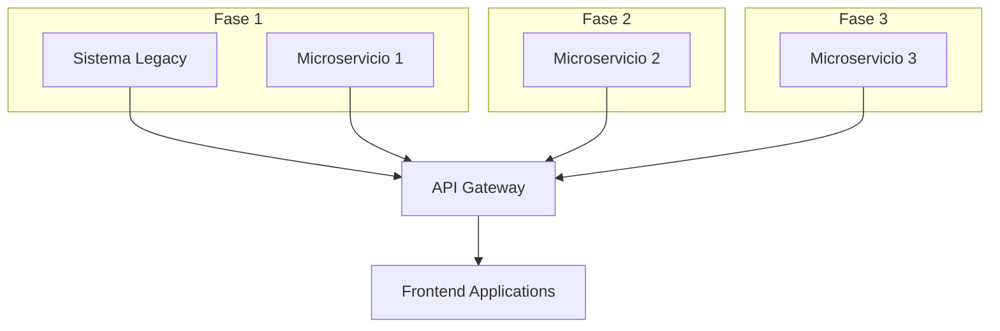
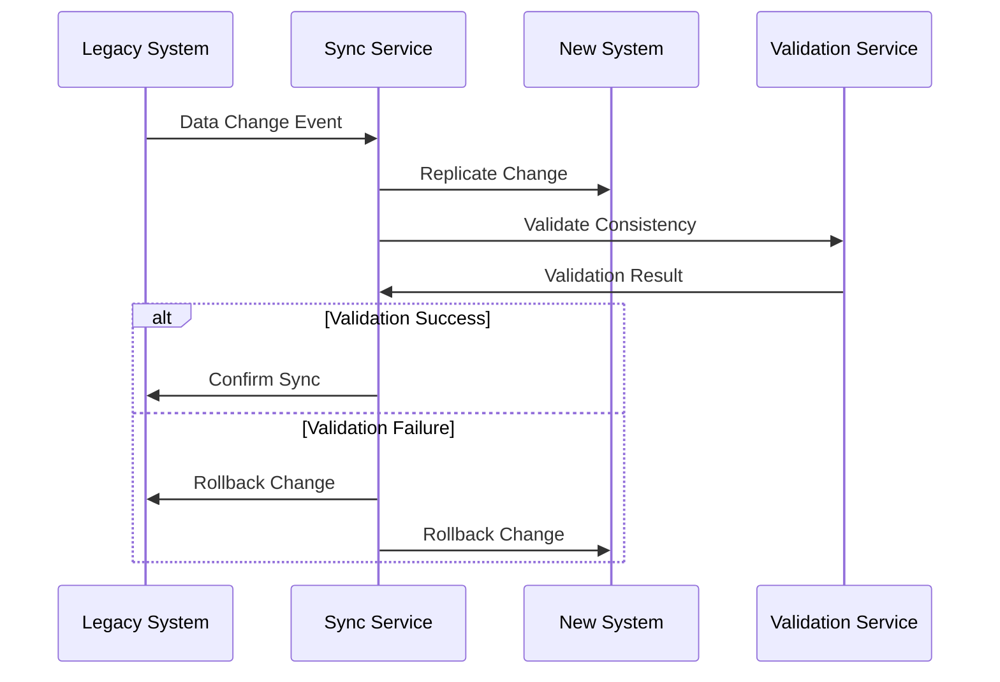
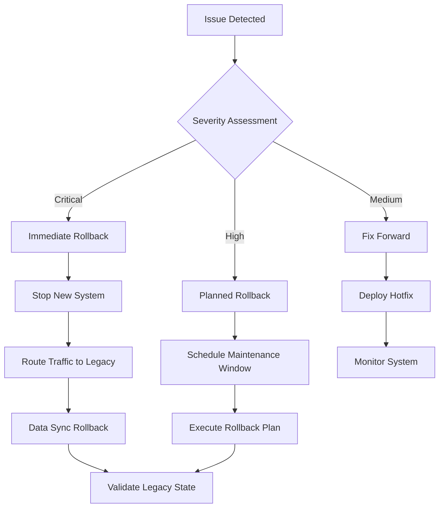

# Plan de Migración

## Visión General

El plan de migración del ecosistema Terpel POS contempla la transición gradual desde el sistema monolítico actual hacia la nueva arquitectura de microservicios, minimizando el impacto operativo y garantizando la continuidad del negocio.

## Estrategia de Migración

### Enfoque: Strangler Fig Pattern

Implementamos el patrón Strangler Fig para reemplazar gradualmente el sistema legacy sin interrumpir las operaciones.



### Principios de Migración

1. **Zero Downtime**: Sin interrupciones en operaciones críticas
2. **Rollback Capability**: Capacidad de rollback en cada fase
3. **Data Consistency**: Consistencia de datos durante la transición
4. **Gradual Migration**: Migración por componentes, no big bang
5. **Parallel Running**: Sistemas legacy y nuevos corriendo en paralelo

## Fases de Migración

### Fase 1: Fundación (Completada - Q4 2023)

**Objetivo**: Establecer infraestructura base y componentes críticos

**Componentes Migrados**:
- ✅ Infraestructura Azure (App Services, PostgreSQL, Service Bus)
- ✅ CI/CD Pipelines básicos
- ✅ Monitoreo y logging centralizado
- ✅ API Gateway configuración inicial

**Resultados**:
- Infraestructura cloud operativa
- Pipelines de deployment automatizados
- Monitoreo básico implementado

---

### Fase 2: Servicios Core (En Progreso - Q1 2024)

**Objetivo**: Migrar servicios críticos de sincronización

**Componentes en Migración**:
- 🟡 MS Sincronización Ventas (85% completado)
- 🟡 MS Sincronización Jornadas (75% completado)
- 🟡 API Frontal Ventas (85% completado)
- 🟡 API Frontal Cierres (80% completado)

**Cronograma**:
- **Enero 31, 2024**: MS Sincronización Ventas en producción
- **Febrero 15, 2024**: MS Sincronización Jornadas en producción
- **Febrero 28, 2024**: APIs Frontend en producción

**Criterios de Éxito**:
- [ ] 99.9% uptime durante migración
- [ ] Latencia < 200ms en APIs críticas
- [ ] Zero data loss
- [ ] Rollback plan tested y documentado

---

### Fase 3: Servicios Secundarios (Q2 2024)

**Objetivo**: Migrar servicios de soporte y procesamiento

**Componentes Planificados**:
- MS Sincronización Anulaciones
- MS Microcierre Backend
- Frontend Microcierre (Electron)
- ETL Ventas

**Cronograma**:
- **Marzo 15, 2024**: MS Sincronización Anulaciones
- **Abril 1, 2024**: MS Microcierre Backend
- **Abril 15, 2024**: Frontend Microcierre Beta
- **Mayo 1, 2024**: ETL Ventas

**Dependencias**:
- Fase 2 completada exitosamente
- Performance testing completado
- User acceptance testing aprobado

---

### Fase 4: Servicios Avanzados (Q3 2024)

**Objetivo**: Migrar servicios especializados y optimizaciones

**Componentes Planificados**:
- MS Conciliación Medios de Pago
- MS Synchronizer POS Web
- ETL Venta Histórica
- Servicios de reportería avanzada

**Cronograma**:
- **Junio 1, 2024**: MS Conciliación Medios de Pago
- **Julio 1, 2024**: MS Synchronizer POS Web
- **Agosto 1, 2024**: ETL Venta Histórica
- **Septiembre 1, 2024**: Reportería avanzada

---

### Fase 5: Optimización y Decommission (Q4 2024)

**Objetivo**: Optimizar sistema nuevo y descomisionar legacy

**Actividades**:
- Performance tuning final
- Decommission sistema legacy
- Optimización de costos
- Documentación final

**Cronograma**:
- **Octubre 1, 2024**: Inicio optimización
- **Noviembre 1, 2024**: Decommission legacy (gradual)
- **Diciembre 31, 2024**: Migración completada

## Estrategia de Datos

### Sincronización de Datos



### Estrategias por Tipo de Dato

| Tipo de Dato | Estrategia | Herramientas | Validación |
|---------------|------------|--------------|------------|
| **Transacciones** | Dual Write + Validation | Custom Sync Service | Checksums, Count validation |
| **Maestros** | Batch Sync + Delta | Azure Data Factory | Business rules validation |
| **Configuración** | Manual Migration | Scripts + Validation | Functional testing |
| **Históricos** | Bulk Transfer | ETL Pipeline | Statistical validation |

### Data Validation Framework

```typescript
interface DataValidationRule {
  name: string;
  source: 'legacy' | 'new';
  target: 'legacy' | 'new';
  validator: (sourceData: any, targetData: any) => ValidationResult;
}

const validationRules: DataValidationRule[] = [
  {
    name: 'transaction-count-validation',
    source: 'legacy',
    target: 'new',
    validator: (legacy, newSystem) => {
      return legacy.transactionCount === newSystem.transactionCount
        ? { valid: true }
        : { valid: false, error: 'Transaction count mismatch' };
    }
  },
  // More validation rules...
];
```

## Gestión de Riesgos

### Riesgos Identificados

| Riesgo | Probabilidad | Impacto | Mitigación |
|--------|--------------|---------|------------|
| **Data Loss durante migración** | Baja | Alto | Dual write + validation, backups frecuentes |
| **Performance degradation** | Media | Alto | Load testing, gradual rollout |
| **Integration failures** | Media | Medio | Extensive testing, rollback plans |
| **User resistance** | Alta | Medio | Training, change management |
| **Timeline delays** | Media | Medio | Buffer time, parallel development |

### Plan de Contingencia

#### Rollback Procedures



#### Rollback Criteria

- **Automatic Rollback**: Error rate > 5%, Latency > 2000ms
- **Manual Rollback**: Data inconsistencies, Critical business impact
- **Rollback Window**: 4 hours maximum for critical systems

## Testing Strategy

### Testing Phases

#### 1. Component Testing
- Unit tests (95% coverage minimum)
- Integration tests
- Contract testing between services

#### 2. System Testing
- End-to-end testing
- Performance testing
- Security testing
- Disaster recovery testing

#### 3. User Acceptance Testing
- Business process validation
- User interface testing
- Training material validation

#### 4. Production Validation
- Canary deployments
- A/B testing
- Shadow traffic testing

### Test Data Management

```yaml
# Test Data Strategy
environments:
  development:
    data_source: "synthetic"
    volume: "10% of production"
    refresh_frequency: "weekly"
  
  qa:
    data_source: "production_subset"
    volume: "30% of production"
    refresh_frequency: "daily"
    
  staging:
    data_source: "production_clone"
    volume: "100% of production"
    refresh_frequency: "real-time"
```

## Change Management

### Stakeholder Communication

| Stakeholder | Communication Method | Frequency | Content |
|-------------|---------------------|-----------|---------|
| **Executive Team** | Executive Dashboard | Weekly | High-level progress, risks, budget |
| **Operations Team** | Technical Briefings | Bi-weekly | Technical details, training needs |
| **End Users** | Training Sessions | Monthly | Feature demos, process changes |
| **IT Support** | Technical Documentation | Continuous | Troubleshooting guides, runbooks |

### Training Plan

#### Phase 1: Technical Team Training
- **Duration**: 2 weeks
- **Content**: New architecture, deployment procedures, troubleshooting
- **Delivery**: Hands-on workshops, documentation

#### Phase 2: Operations Team Training
- **Duration**: 1 week
- **Content**: New processes, monitoring tools, escalation procedures
- **Delivery**: Classroom training, simulations

#### Phase 3: End User Training
- **Duration**: 3 days
- **Content**: New interfaces, changed workflows, support procedures
- **Delivery**: Interactive sessions, user guides

## Métricas y KPIs

### Migration Success Metrics

| Métrica | Objetivo | Actual | Estado |
|---------|----------|--------|--------|
| **Migration Progress** | 100% by Q4 2024 | 35% | 🟡 On Track |
| **System Uptime** | > 99.9% | 99.95% | 🟢 Exceeding |
| **Data Consistency** | 100% | 99.98% | 🟢 Good |
| **Performance** | < 200ms avg | 180ms | 🟢 Good |
| **User Satisfaction** | > 4.0/5.0 | 3.8/5.0 | 🟡 Improving |

### Business Impact Metrics

| Métrica | Baseline | Target | Actual |
|---------|----------|--------|--------|
| **Transaction Processing Time** | 500ms | 200ms | 180ms |
| **System Availability** | 99.5% | 99.9% | 99.95% |
| **Data Sync Latency** | 5 minutes | 30 seconds | 45 seconds |
| **Support Tickets** | 50/week | 20/week | 35/week |

## Budget y Recursos

### Estimación de Costos

| Categoría | Q1 2024 | Q2 2024 | Q3 2024 | Q4 2024 | Total |
|-----------|---------|---------|---------|---------|-------|
| **Infrastructure** | $15,000 | $20,000 | $25,000 | $30,000 | $90,000 |
| **Development** | $80,000 | $60,000 | $40,000 | $20,000 | $200,000 |
| **Testing** | $10,000 | $15,000 | $10,000 | $5,000 | $40,000 |
| **Training** | $5,000 | $8,000 | $3,000 | $2,000 | $18,000 |
| **Contingency** | $11,000 | $10,300 | $7,800 | $5,700 | $34,800 |
| **Total** | $121,000 | $113,300 | $85,800 | $62,700 | $382,800 |

### Resource Allocation

| Rol | Q1 | Q2 | Q3 | Q4 |
|-----|----|----|----|----|
| **Tech Lead** | 1.0 FTE | 1.0 FTE | 0.5 FTE | 0.5 FTE |
| **Backend Developers** | 4.0 FTE | 3.0 FTE | 2.0 FTE | 1.0 FTE |
| **Frontend Developers** | 2.0 FTE | 2.0 FTE | 1.0 FTE | 0.5 FTE |
| **DevOps Engineers** | 2.0 FTE | 2.0 FTE | 1.5 FTE | 1.0 FTE |
| **QA Engineers** | 2.0 FTE | 3.0 FTE | 2.0 FTE | 1.0 FTE |

## Lessons Learned

### Fase 1 Lessons Learned

#### What Went Well
- Infrastructure setup más rápido de lo esperado
- CI/CD pipelines funcionando correctamente desde el inicio
- Equipo se adaptó bien a nuevas herramientas

#### What Could Be Improved
- Subestimamos tiempo de configuración de monitoreo
- Faltó más testing de disaster recovery
- Comunicación con stakeholders podría ser más frecuente

#### Actions for Next Phases
- Incluir más tiempo para configuración de herramientas
- Implementar disaster recovery testing desde el inicio
- Establecer comunicación semanal con stakeholders

---

*Plan actualizado: Enero 2024*  
*Próxima revisión: Febrero 1, 2024*
