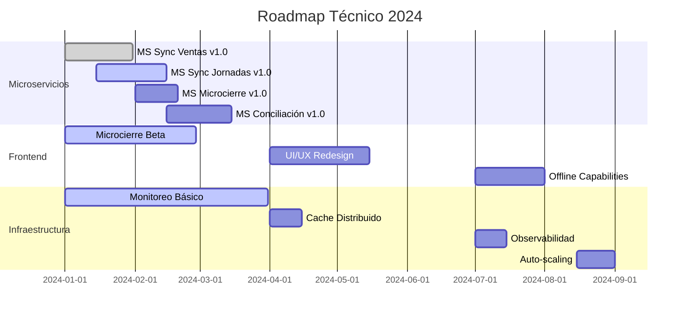

# Roadmap del Proyecto Terpel POS

## Estado Actual del Proyecto

### Resumen Ejecutivo
El proyecto Terpel POS se encuentra en fase de **desarrollo activo** con múltiples componentes en diferentes etapas de madurez. La arquitectura de microservicios está siendo implementada progresivamente, con un enfoque en la estabilidad y la escalabilidad.

### Métricas del Proyecto
| Métrica | Valor | Estado |
|---------|-------|--------|
| **Componentes Totales** | 15 | 📊 En desarrollo |
| **Microservicios** | 8 | 🟡 70% completado |
| **ETLs** | 2 | 🟡 60% completado |
| **APIs Frontend** | 3 | 🟢 80% completado |
| **Frontend Apps** | 1 | 🟡 65% completado |
| **Servicios Auxiliares** | 1 | 🔴 40% completado |
| **Cobertura de Tests** | 65% | 🟡 En progreso |
| **Documentación** | 45% | 🟡 En progreso |

## Estado por Componente

### 🟢 Componentes Estables (Producción Ready)
| Componente | Estado | Última Actualización | Notas |
|------------|--------|---------------------|-------|
| MS Sync Ventas | ✅ Estable | 2024-01-10 | API completa, tests 85% |
| Frontal Node Ventas | ✅ Estable | 2024-01-08 | Performance optimizada |
| Frontal Node Cierres | ✅ Estable | 2024-01-12 | Integración HO completa |

### 🟡 Componentes en Desarrollo
| Componente | Progreso | ETA | Bloqueadores |
|------------|----------|-----|--------------|
| MS Sync Jornadas | 75% | 2024-02-15 | Validaciones de negocio |
| MS Microcierre Backend | 70% | 2024-02-20 | Integración con reportes |
| Frontend Microcierre | 65% | 2024-02-25 | UX/UI refinamiento |
| ETL Ventas | 60% | 2024-03-01 | Optimización performance |
| MS Sync Anulaciones | 80% | 2024-02-10 | Tests de integración |

### 🔴 Componentes en Fase Inicial
| Componente | Progreso | ETA | Prioridad |
|------------|----------|-----|-----------|
| MS Conciliación Medios | 40% | 2024-03-15 | Alta |
| ETL Venta Histórica | 35% | 2024-03-20 | Media |
| MS Node Turnos | 45% | 2024-03-10 | Alta |
| Frontal Node Anulación | 50% | 2024-02-28 | Media |

## Roadmap 2024

### Q1 2024 (Enero - Marzo)
#### Objetivos Principales
- ✅ Completar microservicios core de sincronización
- ✅ Estabilizar APIs frontend principales
- 🔄 Implementar monitoreo básico
- 🔄 Alcanzar 80% cobertura de tests

#### Hitos Clave
- **Enero 31**: Release MS Sync Ventas v1.0
- **Febrero 15**: Release MS Sync Jornadas v1.0
- **Febrero 28**: Release Frontend Microcierre Beta
- **Marzo 15**: Release MS Conciliación Medios v1.0
- **Marzo 31**: Integración completa POS-HO

#### Entregables
- [ ] 5 microservicios en producción
- [ ] 3 APIs frontend estables
- [ ] 1 aplicación frontend funcional
- [ ] Dashboard de monitoreo básico
- [ ] Documentación técnica completa

### Q2 2024 (Abril - Junio)
#### Objetivos Principales
- 🔄 Optimización de performance
- 🔄 Implementación de cache distribuido
- 🔄 Mejoras de UX/UI
- 🔄 Automatización de despliegues

#### Hitos Clave
- **Abril 15**: Implementar Redis cache
- **Mayo 1**: Optimizar queries de base de datos
- **Mayo 15**: Rediseño UI/UX frontend
- **Junio 1**: CI/CD completamente automatizado
- **Junio 30**: Performance benchmarks alcanzados

#### Entregables
- [ ] Cache distribuido implementado
- [ ] Performance mejorado 40%
- [ ] UI/UX rediseñado
- [ ] Pipeline CI/CD automatizado
- [ ] Métricas de performance establecidas

### Q3 2024 (Julio - Septiembre)
#### Objetivos Principales
- 🔄 Implementar observabilidad avanzada
- 🔄 Agregar capacidades offline
- 🔄 Mejorar seguridad
- 🔄 Escalabilidad horizontal

#### Hitos Clave
- **Julio 15**: Distributed tracing implementado
- **Agosto 1**: Capacidades offline en frontend
- **Agosto 15**: Auditoría de seguridad completa
- **Septiembre 1**: Auto-scaling configurado
- **Septiembre 30**: Load testing completado

#### Entregables
- [ ] Observabilidad completa (logs, métricas, traces)
- [ ] Modo offline funcional
- [ ] Seguridad hardening completado
- [ ] Auto-scaling implementado
- [ ] Documentación de operaciones

### Q4 2024 (Octubre - Diciembre)
#### Objetivos Principales
- 🔄 Preparación para producción masiva
- 🔄 Disaster recovery
- 🔄 Capacitación y documentación
- 🔄 Optimizaciones finales

#### Hitos Clave
- **Octubre 15**: Disaster recovery plan
- **Noviembre 1**: Capacitación equipos operativos
- **Noviembre 15**: Pilot en estaciones seleccionadas
- **Diciembre 1**: Go-live preparación
- **Diciembre 31**: Sistema production-ready

#### Entregables
- [ ] Plan de disaster recovery
- [ ] Equipos capacitados
- [ ] Pilot exitoso
- [ ] Sistema listo para producción
- [ ] Documentación operativa completa

## Roadmap Técnico Detallado

### Arquitectura y Infraestructura

### Dependencias y Riesgos

#### Dependencias Críticas
| Dependencia | Impacto | Mitigación |
|-------------|---------|------------|
| **Head Office API** | Alto | Implementar circuit breaker y fallback |
| **PostgreSQL Performance** | Alto | Optimización de queries y índices |
| **Azure Service Bus** | Medio | Implementar cola local de respaldo |
| **Electron Framework** | Medio | Evaluar alternativas (Tauri, PWA) |

#### Riesgos Identificados
| Riesgo | Probabilidad | Impacto | Mitigación |
|--------|--------------|---------|------------|
| **Retrasos en HO API** | Media | Alto | Desarrollo paralelo con mocks |
| **Performance BD** | Alta | Alto | Optimización proactiva |
| **Complejidad UI/UX** | Media | Medio | Prototipado temprano |
| **Integración POS** | Baja | Alto | Testing exhaustivo |

## Métricas y KPIs

### Métricas de Desarrollo
| KPI | Objetivo Q1 | Objetivo Q2 | Objetivo Q3 | Objetivo Q4 |
|-----|-------------|-------------|-------------|-------------|
| **Cobertura Tests** | 80% | 85% | 90% | 95% |
| **Bugs Críticos** | <5 | <3 | <2 | <1 |
| **Tiempo Deploy** | <30min | <15min | <10min | <5min |
| **Uptime** | 99% | 99.5% | 99.9% | 99.95% |

### Métricas de Performance
| Métrica | Baseline | Q1 Target | Q2 Target | Q3 Target | Q4 Target |
|---------|----------|-----------|-----------|-----------|-----------|
| **API Response Time** | 500ms | 300ms | 200ms | 150ms | 100ms |
| **DB Query Time** | 100ms | 80ms | 50ms | 30ms | 20ms |
| **Frontend Load Time** | 3s | 2s | 1.5s | 1s | 0.8s |
| **Throughput (TPS)** | 100 | 200 | 500 | 1000 | 2000 |

## Recursos y Equipo

### Equipo Actual
| Rol | Cantidad | Asignación |
|-----|----------|------------|
| **Tech Lead** | 1 | Arquitectura y coordinación |
| **Backend Developers** | 4 | Microservicios y APIs |
| **Frontend Developers** | 2 | Aplicaciones cliente |
| **DevOps Engineers** | 2 | Infraestructura y CI/CD |
| **QA Engineers** | 2 | Testing y calidad |
| **Product Owner** | 1 | Requisitos y priorización |

### Necesidades de Recursos
| Período | Necesidad | Justificación |
|---------|-----------|---------------|
| **Q1 2024** | +1 Backend Dev | Acelerar desarrollo microservicios |
| **Q2 2024** | +1 Frontend Dev | Mejorar UX/UI |
| **Q3 2024** | +1 DevOps | Implementar observabilidad |
| **Q4 2024** | +1 QA | Testing pre-producción |

## Plan de Comunicación

### Stakeholders
- **Equipo Técnico**: Updates semanales, retrospectivas
- **Management**: Reports mensuales, demos trimestrales
- **Usuarios Finales**: Demos beta, feedback sessions
- **Operaciones**: Documentación, capacitación

### Canales de Comunicación
- **Slack**: #terpel-pos-dev (diario)
- **Jira**: Tracking de issues y progress
- **Confluence**: Documentación y decisiones
- **Teams**: Meetings y presentaciones

## Criterios de Éxito

### Criterios Técnicos
- ✅ Todos los microservicios en producción
- ✅ Performance targets alcanzados
- ✅ 95%+ cobertura de tests
- ✅ Zero downtime deployments
- ✅ Observabilidad completa

### Criterios de Negocio
- ✅ Reducción 50% tiempo de microcierre
- ✅ 99.9% disponibilidad del sistema
- ✅ Sincronización tiempo real con HO
- ✅ Satisfacción usuario >4.5/5
- ✅ ROI positivo en 12 meses

---

*Última actualización: Enero 2024*
*Próxima revisión: Febrero 15, 2024*
