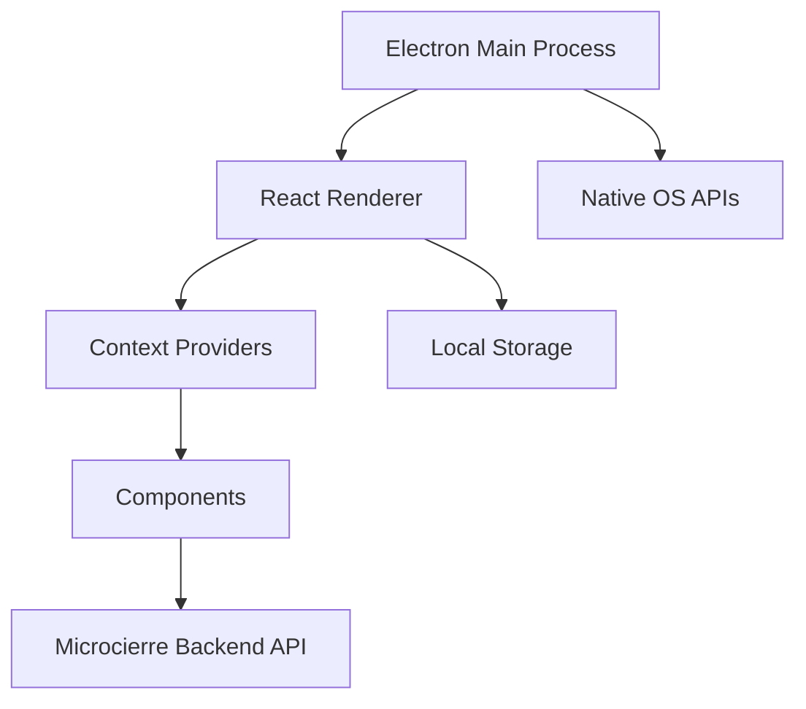

# Frontend POS Microcierre

## Descripción

Aplicación de escritorio desarrollada en Electron para la gestión de microcierres en las estaciones de servicio Terpel. Proporciona una interfaz intuitiva para que los operadores realicen cierres parciales de turno y consulten información de ventas en tiempo real.

## Información Técnica

| Atributo | Valor |
|----------|-------|
| **Nombre del Proyecto** | ap31tpt-terpelpos-transicion-ft-pos-microcierrefront |
| **Tecnología** | Electron + React + TypeScript |
| **Framework UI** | React 18 |
| **Bundler** | Webpack + Forge |
| **Estilos** | Tailwind CSS |
| **Estado** | Context API + Hooks |

## Arquitectura



## Funcionalidades Principales

### 1. Gestión de Microcierres
- Inicio de microcierre de turno
- Consulta de ventas del período
- Validación de totales
- Generación de reportes

### 2. Dashboard de Ventas
- Resumen de ventas por producto
- Gráficos de rendimiento
- Comparativas por período
- Alertas de discrepancias

### 3. Configuración
- Configuración de estación
- Parámetros de conexión
- Preferencias de usuario
- Temas y personalización

## Estructura del Proyecto

```
src/
├── index.ts              # Proceso principal Electron
├── main.tsx             # Punto de entrada React
├── app.tsx              # Componente raíz
├── preload.ts           # Script de preload
├── renderer.ts          # Configuración renderer
├── components/          # Componentes React
│   ├── Dashboard/       # Dashboard principal
│   ├── Microcierre/     # Componentes de microcierre
│   ├── Reports/         # Generación de reportes
│   ├── Settings/        # Configuraciones
│   └── Common/          # Componentes reutilizables
├── context/             # Context providers
│   ├── AppContext.tsx   # Estado global
│   ├── AuthContext.tsx  # Autenticación
│   └── DataContext.tsx  # Datos de negocio
├── public/              # Recursos estáticos
└── assets/              # Imágenes y logos
```

## Componentes Principales

### Dashboard Component
```typescript
interface DashboardProps {
  stationId: string;
  currentShift: Shift;
}

const Dashboard: React.FC<DashboardProps> = ({ stationId, currentShift }) => {
  const { salesData, loading } = useSalesData(stationId, currentShift.id);
  
  return (
    <div className="dashboard-container">
      <SalesOverview data={salesData} />
      <ProductSummary products={salesData.products} />
      <PaymentMethods payments={salesData.payments} />
    </div>
  );
};
```

### Microcierre Component
```typescript
const MicrocierreForm: React.FC = () => {
  const [formData, setFormData] = useState<MicrocierreData>();
  const { submitMicrocierre } = useMicrocierre();
  
  const handleSubmit = async (data: MicrocierreData) => {
    try {
      await submitMicrocierre(data);
      showSuccess('Microcierre procesado exitosamente');
    } catch (error) {
      showError('Error al procesar microcierre');
    }
  };
  
  return (
    <form onSubmit={handleSubmit}>
      {/* Form fields */}
    </form>
  );
};
```

## Configuración de Electron

### Main Process (index.ts)
```typescript
import { app, BrowserWindow, ipcMain } from 'electron';
import path from 'path';

const createWindow = (): void => {
  const mainWindow = new BrowserWindow({
    height: 800,
    width: 1200,
    webPreferences: {
      preload: path.join(__dirname, 'preload.js'),
      nodeIntegration: false,
      contextIsolation: true,
    },
    icon: path.join(__dirname, '../assets/LogoTerpelPos.ico'),
    titleBarStyle: 'default',
    resizable: true,
    minimizable: true,
  });

  mainWindow.loadFile(path.join(__dirname, '../src/index.html'));
};
```

### Preload Script
```typescript
import { contextBridge, ipcRenderer } from 'electron';

contextBridge.exposeInMainWorld('electronAPI', {
  // API methods
  getMicrocierreData: () => ipcRenderer.invoke('get-microcierre-data'),
  saveMicrocierre: (data: any) => ipcRenderer.invoke('save-microcierre', data),
  printReport: (reportData: any) => ipcRenderer.invoke('print-report', reportData),
  
  // Event listeners
  onDataUpdate: (callback: Function) => {
    ipcRenderer.on('data-update', callback);
  },
});
```

## Integración con Backend

### API Client
```typescript
class MicrocierreApiClient {
  private baseUrl: string;
  private apiKey: string;

  constructor(baseUrl: string, apiKey: string) {
    this.baseUrl = baseUrl;
    this.apiKey = apiKey;
  }

  async getSalesData(stationId: string, shiftId: string): Promise<SalesData> {
    const response = await fetch(`${this.baseUrl}/sales/${stationId}/${shiftId}`, {
      headers: {
        'Authorization': `Bearer ${this.apiKey}`,
        'Content-Type': 'application/json',
      },
    });
    
    if (!response.ok) {
      throw new Error(`API Error: ${response.status}`);
    }
    
    return response.json();
  }

  async submitMicrocierre(data: MicrocierreData): Promise<MicrocierreResponse> {
    const response = await fetch(`${this.baseUrl}/microcierre`, {
      method: 'POST',
      headers: {
        'Authorization': `Bearer ${this.apiKey}`,
        'Content-Type': 'application/json',
      },
      body: JSON.stringify(data),
    });
    
    return response.json();
  }
}
```

## Estilos y UI

### Tailwind Configuration
```javascript
module.exports = {
  content: ['./src/**/*.{js,jsx,ts,tsx}'],
  theme: {
    extend: {
      colors: {
        terpel: {
          red: '#E31E24',
          orange: '#FF6B35',
          gray: '#6B7280',
        },
      },
      fontFamily: {
        sans: ['Inter', 'sans-serif'],
      },
    },
  },
  plugins: [],
};
```

### Componente de Estilo
```typescript
const Card: React.FC<{ children: React.ReactNode; title?: string }> = ({ 
  children, 
  title 
}) => (
  <div className="bg-white rounded-lg shadow-md p-6 mb-4">
    {title && (
      <h3 className="text-lg font-semibold text-gray-800 mb-4">{title}</h3>
    )}
    {children}
  </div>
);
```

## Build y Distribución

### Configuración de Forge
```typescript
// forge.config.ts
import type { ForgeConfig } from '@electron-forge/shared-types';
import { MakerSquirrel } from '@electron-forge/maker-squirrel';
import { MakerZIP } from '@electron-forge/maker-zip';
import { WebpackPlugin } from '@electron-forge/plugin-webpack';

const config: ForgeConfig = {
  packagerConfig: {
    name: 'Terpel POS Microcierre',
    icon: './assets/LogoTerpelPos',
    asar: true,
  },
  rebuildConfig: {},
  makers: [
    new MakerSquirrel({
      name: 'TerpelPOSMicrocierre',
      setupIcon: './assets/LogoTerpelPos.ico',
    }),
    new MakerZIP({}, ['darwin']),
  ],
  plugins: [
    new WebpackPlugin({
      mainConfig: './webpack.main.config.ts',
      renderer: {
        config: './webpack.renderer.config.ts',
        entryPoints: [
          {
            html: './src/index.html',
            js: './src/renderer.ts',
            name: 'main_window',
            preload: {
              js: './src/preload.ts',
            },
          },
        ],
      },
    }),
  ],
};

export default config;
```

### Scripts de Build
```json
{
  "scripts": {
    "start": "electron-forge start",
    "package": "electron-forge package",
    "make": "electron-forge make",
    "publish": "electron-forge publish",
    "lint": "eslint --ext .ts,.tsx .",
    "test": "jest"
  }
}
```

## Instalación y Desarrollo

### Prerrequisitos
- Node.js 18+
- Yarn
- Python 3 (para compilación nativa)
- Visual Studio Build Tools (Windows)

### Instalación

```bash
# Instalar dependencias
yarn install

# Instalar dependencias nativas
yarn install --frozen-lockfile

# Configurar variables de entorno
cp .env.example .env
```

### Desarrollo

```bash
# Iniciar en modo desarrollo
yarn start

# Build para producción
yarn make

# Ejecutar tests
yarn test

# Linting
yarn lint
```

## Testing

### Tests Unitarios
```typescript
// __tests__/components/Dashboard.test.tsx
import { render, screen } from '@testing-library/react';
import { Dashboard } from '../src/components/Dashboard';

describe('Dashboard Component', () => {
  test('renders sales overview', () => {
    const mockData = {
      totalSales: 1000000,
      transactionCount: 50,
    };
    
    render(<Dashboard salesData={mockData} />);
    
    expect(screen.getByText('$1,000,000')).toBeInTheDocument();
    expect(screen.getByText('50 transacciones')).toBeInTheDocument();
  });
});
```

### Tests E2E
```typescript
// e2e/microcierre.spec.ts
import { test, expect } from '@playwright/test';

test('complete microcierre flow', async ({ page }) => {
  await page.goto('/');
  
  // Navigate to microcierre
  await page.click('[data-testid="microcierre-button"]');
  
  // Fill form
  await page.fill('[data-testid="operator-id"]', 'OP001');
  await page.fill('[data-testid="cash-amount"]', '500000');
  
  // Submit
  await page.click('[data-testid="submit-button"]');
  
  // Verify success
  await expect(page.locator('[data-testid="success-message"]')).toBeVisible();
});
```

## Configuración

### Variables de Entorno
```bash
# API Configuration
REACT_APP_API_URL=http://localhost:3000
REACT_APP_API_KEY=your-api-key

# Station Configuration
REACT_APP_STATION_ID=EST-001
REACT_APP_STATION_NAME=Estación Centro

# Feature Flags
REACT_APP_ENABLE_REPORTS=true
REACT_APP_ENABLE_ANALYTICS=false
```

### Configuración Local
```typescript
// src/config/app.config.ts
export const appConfig = {
  api: {
    baseUrl: process.env.REACT_APP_API_URL || 'http://localhost:3000',
    timeout: 30000,
  },
  station: {
    id: process.env.REACT_APP_STATION_ID || 'EST-001',
    name: process.env.REACT_APP_STATION_NAME || 'Estación Default',
  },
  features: {
    reports: process.env.REACT_APP_ENABLE_REPORTS === 'true',
    analytics: process.env.REACT_APP_ENABLE_ANALYTICS === 'true',
  },
};
```

## Troubleshooting

### Problemas Comunes

1. **Error de conexión con backend**
   - Verificar URL de API en configuración
   - Comprobar que el backend esté ejecutándose
   - Validar API key

2. **Aplicación no inicia**
   - Verificar versión de Node.js
   - Reinstalar dependencias: `yarn install --force`
   - Limpiar cache: `yarn cache clean`

3. **Error en build**
   - Verificar dependencias nativas
   - Instalar Visual Studio Build Tools (Windows)
   - Verificar permisos de escritura

## Roadmap

- [ ] Implementar modo offline
- [ ] Agregar sincronización automática
- [ ] Mejorar UX/UI con animaciones
- [ ] Implementar notificaciones push
- [ ] Agregar soporte multi-idioma
- [ ] Optimizar rendimiento
- [ ] Implementar auto-updater

## Contacto

- **Equipo**: Terpel POS Frontend Team
- **Slack**: #terpel-pos-frontend
- **Email**: pos-frontend@terpel.com
