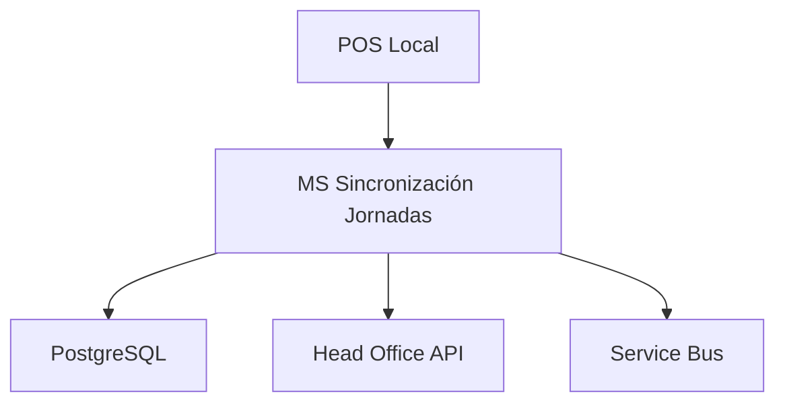

# MS POS Sincronización Jornadas

## Descripción

Microservicio encargado de la sincronización de jornadas laborales entre el sistema POS local y el Head Office. Gestiona la apertura, cierre y control de jornadas de trabajo en las estaciones de servicio.

## Información Técnica

| Atributo | Valor |
|----------|-------|
| **Nombre del Proyecto** | ap31tpt-terpelpos-transicion-ms-pos-sincronizacion-jornadas |
| **Tecnología** | Node.js + NestJS |
| **Versión Node** | 18.17.1 |
| **Versión Nest** | 10.1.11 |
| **Base de Datos** | PostgreSQL |
| **Puerto** | 3000 (configurable) |

## Arquitectura



## Funcionalidades Principales

### 1. Gestión de Jornadas
- Apertura de jornada laboral
- Cierre de jornada laboral
- Validación de estados de jornada
- Sincronización con Head Office

### 2. Control de Turnos
- Registro de inicio de turno
- Registro de fin de turno
- Validación de operadores
- Control de solapamiento de turnos

### 3. Sincronización
- Envío de datos al Head Office
- Recepción de confirmaciones
- Manejo de errores de conectividad
- Cola de reintentos

## Estructura del Proyecto

```
src/
├── app.controller.ts      # Controlador principal
├── app.service.ts         # Lógica de negocio
├── app.module.ts          # Módulo principal
├── main.ts               # Punto de entrada
├── pg.pool.ts            # Configuración PostgreSQL
├── common/               # Utilidades comunes
├── config/               # Configuraciones
└── interface/            # Interfaces TypeScript
```

## Endpoints API

### POST /jornada/abrir
Abre una nueva jornada laboral.

**Request:**
```json
{
  "estacionId": "string",
  "operadorId": "string",
  "fechaHora": "2024-01-15T08:00:00Z"
}
```

**Response:**
```json
{
  "jornadaId": "string",
  "estado": "ABIERTA",
  "fechaApertura": "2024-01-15T08:00:00Z"
}
```

### POST /jornada/cerrar
Cierra la jornada laboral activa.

**Request:**
```json
{
  "jornadaId": "string",
  "operadorId": "string",
  "fechaHora": "2024-01-15T20:00:00Z"
}
```

### GET /jornada/estado/{jornadaId}
Consulta el estado actual de una jornada.

## Configuración

### Variables de Entorno

```bash
# Base de datos
DB_HOST=localhost
DB_PORT=5432
DB_NAME=terpel_pos
DB_USER=postgres
DB_PASSWORD=password

# Head Office
HO_API_URL=https://api.headoffice.terpel.com
HO_API_KEY=your-api-key

# Service Bus
SERVICE_BUS_CONNECTION=your-connection-string
QUEUE_NAME=jornadas-sync
```

### Configuración de Base de Datos

El microservicio utiliza PostgreSQL con las siguientes tablas principales:

- `jornadas`: Registro de jornadas laborales
- `turnos`: Control de turnos por operador
- `sync_log`: Log de sincronizaciones

## Instalación y Ejecución

### Prerrequisitos
- Node.js 18.17.1
- PostgreSQL 12+
- Yarn

### Instalación

```bash
# Instalar dependencias
yarn install

# Configurar variables de entorno
cp .env.example .env
```

### Ejecución

```bash
# Desarrollo
yarn start:dev

# Producción
yarn start:prod

# Tests
yarn test
yarn test:e2e
```

## CI/CD

El proyecto utiliza Azure DevOps con el pipeline definido en `azure-pipelines.yml`:

- **Build**: Compilación y tests
- **Security**: Análisis con SonarCloud
- **Deploy**: Despliegue automático a entornos

## Monitoreo y Logs

### Health Check
- **Endpoint**: `/health`
- **Métricas**: Estado de BD, conectividad HO

### Logging
- Nivel: INFO, WARN, ERROR
- Formato: JSON estructurado
- Destino: Azure Application Insights

## Troubleshooting

### Problemas Comunes

1. **Error de conexión a BD**
   - Verificar variables de entorno
   - Comprobar conectividad de red

2. **Fallo en sincronización**
   - Revisar logs de Service Bus
   - Verificar API Key del Head Office

3. **Jornada no se puede cerrar**
   - Validar que no hay turnos activos
   - Verificar estado de transacciones pendientes

## Dependencias

### Principales
- `@nestjs/core`: Framework principal
- `pg`: Cliente PostgreSQL
- `axios`: Cliente HTTP
- `@azure/service-bus`: Integración Service Bus

### Desarrollo
- `jest`: Testing framework
- `supertest`: Tests de integración
- `eslint`: Linting
- `prettier`: Formateo de código

## Roadmap

- [ ] Implementar cache Redis
- [ ] Agregar métricas Prometheus
- [ ] Mejorar manejo de errores
- [ ] Implementar circuit breaker
- [ ] Documentación OpenAPI

## Contacto

- **Equipo**: Terpel POS Development Team
- **Slack**: #terpel-pos-dev
- **Email**: pos-dev@terpel.com
