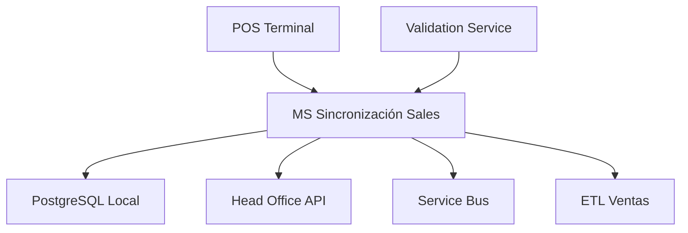
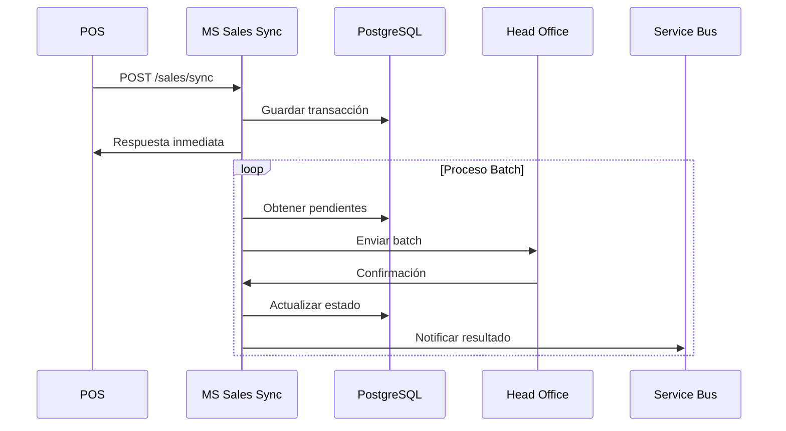

# MS POS Sincronización Sales

## Descripción

Microservicio responsable de la sincronización de transacciones de venta entre el sistema POS local y el Head Office. Procesa, valida y envía todas las transacciones de venta realizadas en las estaciones de servicio.

## Información Técnica

| Atributo | Valor |
|----------|-------|
| **Nombre del Proyecto** | ap31tpt-terpelpos-transicion-ms-pos-sincronizacion-sales |
| **Tecnología** | Node.js + NestJS |
| **Versión Node** | 18.17.1 |
| **Base de Datos** | PostgreSQL |
| **Puerto** | 3001 (configurable) |

## Arquitectura



## Funcionalidades Principales

### 1. Procesamiento de Ventas
- Recepción de transacciones desde POS
- Validación de datos de venta
- Cálculo de totales e impuestos
- Generación de números de transacción

### 2. Sincronización con Head Office
- Envío batch de transacciones
- Confirmación de recepción
- Manejo de errores y reintentos
- Reconciliación de datos

### 3. Gestión de Estados
- Control de estados de transacción
- Seguimiento de sincronización
- Alertas por fallos
- Reportes de estado

## Estructura del Proyecto

```
src/
├── app.controller.ts      # Controlador principal
├── app.service.ts         # Lógica de sincronización
├── app.module.ts          # Módulo principal
├── main.ts               # Punto de entrada
├── pg.pool.ts            # Pool de conexiones PostgreSQL
├── common/               # Utilidades y helpers
│   ├── validators/       # Validadores de negocio
│   ├── transformers/     # Transformadores de datos
│   └── constants/        # Constantes del sistema
├── config/               # Configuraciones
└── interface/            # Interfaces y DTOs
```

## Endpoints API

### POST /sales/sync
Sincroniza una transacción de venta.

**Request:**
```json
{
  "transactionId": "TXN-2024-001",
  "stationId": "EST-001",
  "posId": "POS-01",
  "timestamp": "2024-01-15T14:30:00Z",
  "items": [
    {
      "productId": "GASOLINA-CORRIENTE",
      "quantity": 45.50,
      "unitPrice": 12500,
      "total": 568750
    }
  ],
  "payments": [
    {
      "method": "EFECTIVO",
      "amount": 568750
    }
  ],
  "totals": {
    "subtotal": 568750,
    "tax": 0,
    "total": 568750
  }
}
```

**Response:**
```json
{
  "syncId": "SYNC-2024-001",
  "status": "PENDING",
  "timestamp": "2024-01-15T14:30:05Z",
  "hoReference": "HO-REF-001"
}
```

### GET /sales/status/{syncId}
Consulta el estado de sincronización.

### POST /sales/batch
Sincronización en lote de múltiples transacciones.

### GET /sales/pending
Lista transacciones pendientes de sincronización.

## Configuración

### Variables de Entorno

```bash
# Base de datos
DB_HOST=localhost
DB_PORT=5432
DB_NAME=terpel_pos_sales
DB_USER=sales_user
DB_PASSWORD=sales_password
DB_POOL_SIZE=10

# Head Office
HO_SALES_API_URL=https://api.headoffice.terpel.com/sales
HO_API_KEY=your-sales-api-key
HO_TIMEOUT=30000

# Service Bus
SERVICE_BUS_CONNECTION=your-connection-string
SALES_QUEUE_NAME=sales-sync
RETRY_QUEUE_NAME=sales-retry

# Configuración de Sync
BATCH_SIZE=100
SYNC_INTERVAL=60000
MAX_RETRIES=3
RETRY_DELAY=5000
```

## Modelo de Datos

### Tabla: sales_transactions
```sql
CREATE TABLE sales_transactions (
    id UUID PRIMARY KEY,
    transaction_id VARCHAR(50) UNIQUE NOT NULL,
    station_id VARCHAR(20) NOT NULL,
    pos_id VARCHAR(20) NOT NULL,
    timestamp TIMESTAMP NOT NULL,
    data JSONB NOT NULL,
    sync_status VARCHAR(20) DEFAULT 'PENDING',
    sync_attempts INTEGER DEFAULT 0,
    last_sync_attempt TIMESTAMP,
    ho_reference VARCHAR(50),
    created_at TIMESTAMP DEFAULT NOW(),
    updated_at TIMESTAMP DEFAULT NOW()
);
```

### Tabla: sync_log
```sql
CREATE TABLE sync_log (
    id UUID PRIMARY KEY,
    transaction_id VARCHAR(50) NOT NULL,
    sync_type VARCHAR(20) NOT NULL,
    status VARCHAR(20) NOT NULL,
    request_data JSONB,
    response_data JSONB,
    error_message TEXT,
    timestamp TIMESTAMP DEFAULT NOW()
);
```

## Flujo de Sincronización



## Instalación y Ejecución

### Prerrequisitos
- Node.js 18.17.1
- PostgreSQL 13+
- Yarn
- Acceso a Head Office API

### Instalación

```bash
# Instalar dependencias
yarn install

# Configurar base de datos
yarn db:migrate
yarn db:seed

# Configurar variables de entorno
cp .env.example .env
```

### Ejecución

```bash
# Desarrollo con hot reload
yarn start:dev

# Producción
yarn build
yarn start:prod

# Tests
yarn test
yarn test:e2e
yarn test:cov
```

## Monitoreo y Métricas

### Health Checks
- **Database**: Conectividad y latencia
- **Head Office**: Disponibilidad API
- **Service Bus**: Estado de colas

### Métricas Clave
- Transacciones por minuto
- Tiempo de sincronización promedio
- Tasa de errores
- Transacciones pendientes

### Alertas
- Acumulación de transacciones pendientes
- Fallos consecutivos de sincronización
- Latencia alta en Head Office

## Troubleshooting

### Problemas Comunes

1. **Transacciones no se sincronizan**
   ```bash
   # Verificar estado de la cola
   yarn queue:status
   
   # Revisar logs
   yarn logs:tail
   ```

2. **Error de validación de datos**
   - Verificar formato de transacción
   - Validar campos obligatorios
   - Comprobar tipos de datos

3. **Timeout con Head Office**
   - Aumentar timeout en configuración
   - Verificar conectividad de red
   - Revisar estado del servicio HO

## Testing

### Tests Unitarios
```bash
# Ejecutar tests unitarios
yarn test

# Con coverage
yarn test:cov
```

### Tests de Integración
```bash
# Tests E2E
yarn test:e2e

# Tests específicos
yarn test sales.service.spec.ts
```

### Tests de Carga
```bash
# Simular carga de transacciones
yarn test:load
```

## Seguridad

### Autenticación
- API Key para Head Office
- JWT tokens para endpoints internos

### Validación
- Sanitización de datos de entrada
- Validación de esquemas JSON
- Rate limiting

### Encriptación
- Datos sensibles encriptados en BD
- TLS para comunicaciones

## Performance

### Optimizaciones
- Connection pooling para PostgreSQL
- Batch processing para sincronización
- Índices optimizados en BD
- Cache para consultas frecuentes

### Configuración Recomendada
```bash
# Para alta carga
DB_POOL_SIZE=20
BATCH_SIZE=500
SYNC_INTERVAL=30000
```

## Roadmap

- [ ] Implementar cache distribuido (Redis)
- [ ] Agregar compresión de datos
- [ ] Implementar circuit breaker pattern
- [ ] Métricas avanzadas con Prometheus
- [ ] Dashboard de monitoreo
- [ ] Optimización de queries
- [ ] Implementar CDC (Change Data Capture)

## Contacto y Soporte

- **Equipo**: Terpel POS Development Team
- **Slack**: #terpel-pos-sales
- **Email**: pos-sales@terpel.com
- **On-call**: +57-xxx-xxx-xxxx
