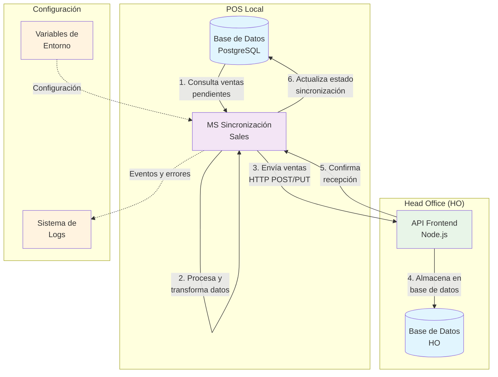
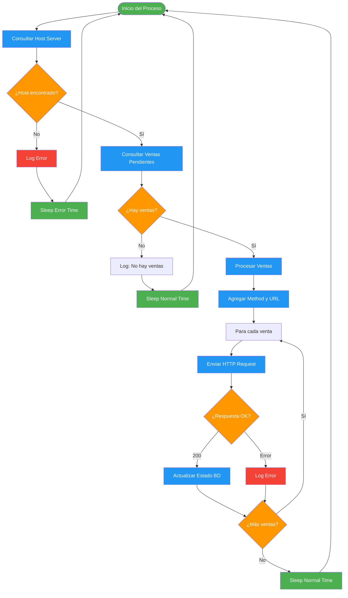
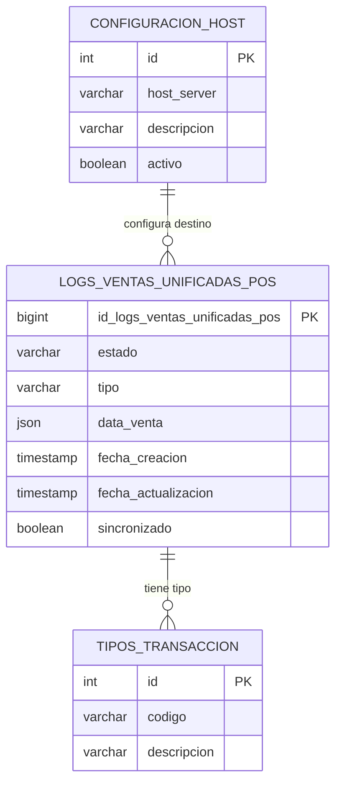
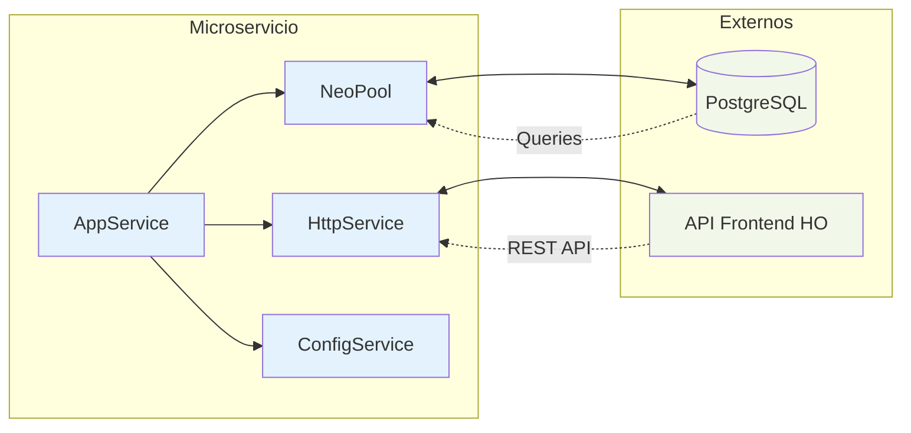
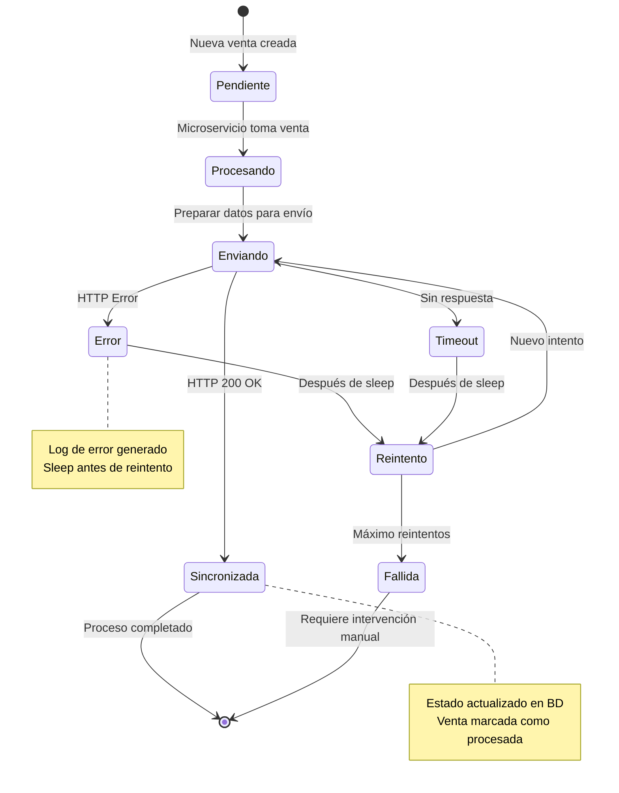
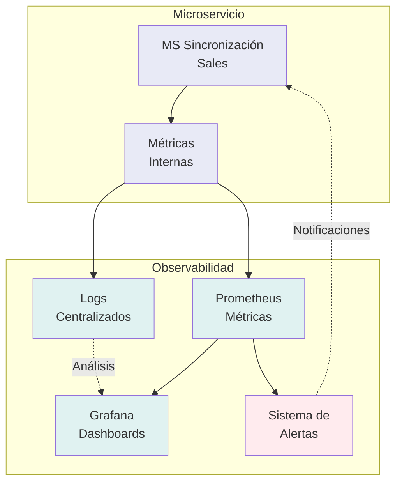

# Diagramas de Arquitectura - MS POS Sincronización Sales

## 🏗️ Diagrama de Arquitectura General



## 🔄 Diagrama de Flujo de Proceso



## 🗄️ Diagrama de Base de Datos



## 🔌 Diagrama de Integraciones



## 📊 Diagrama de Estados de Venta



## 🚀 Diagrama de Despliegue

```mermaid
deployment
    node "Servidor POS" {
        component "MS Sincronización Sales" as MS
        database "PostgreSQL Local" as DBLOCAL
    }
    
    node "Servidor HO" {
        component "API Frontend" as API
        database "PostgreSQL HO" as DBHO
    }
    
    cloud "Red Terpel" {
        interface "HTTP/HTTPS" as NET
    }
    
    MS --> NET : REST API Calls
    NET --> API : Forward Requests
    
    MS --> DBLOCAL : SQL Queries
    API --> DBHO : SQL Queries
    
    note top of MS : Puerto: 3000\nProtocolo: HTTP
    note top of API : Puerto: 8080\nProtocolo: HTTPS
```

## 📈 Diagrama de Métricas y Monitoreo



---

**Nota**: Estos diagramas pueden ser renderizados usando cualquier herramienta compatible con Mermaid como:
- GitHub/GitLab (renderizado automático)
- Mermaid Live Editor
- VS Code con extensión Mermaid
- Confluence con plugin Mermaid
