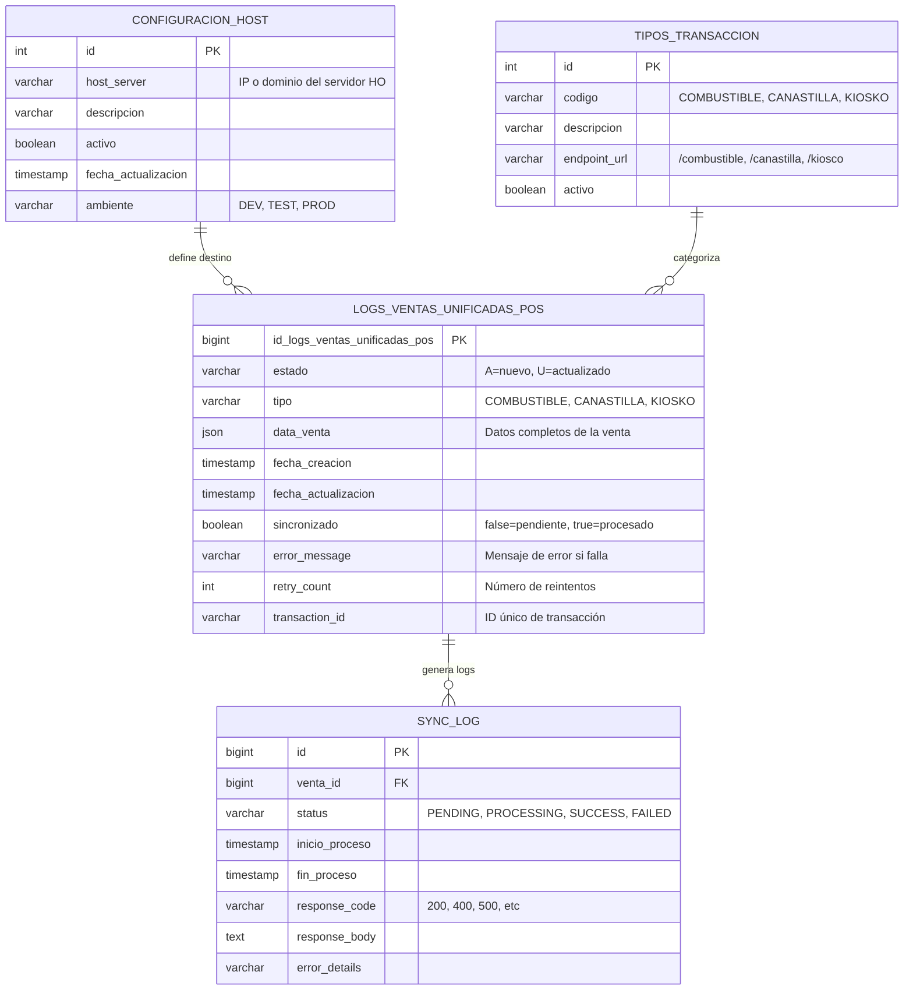
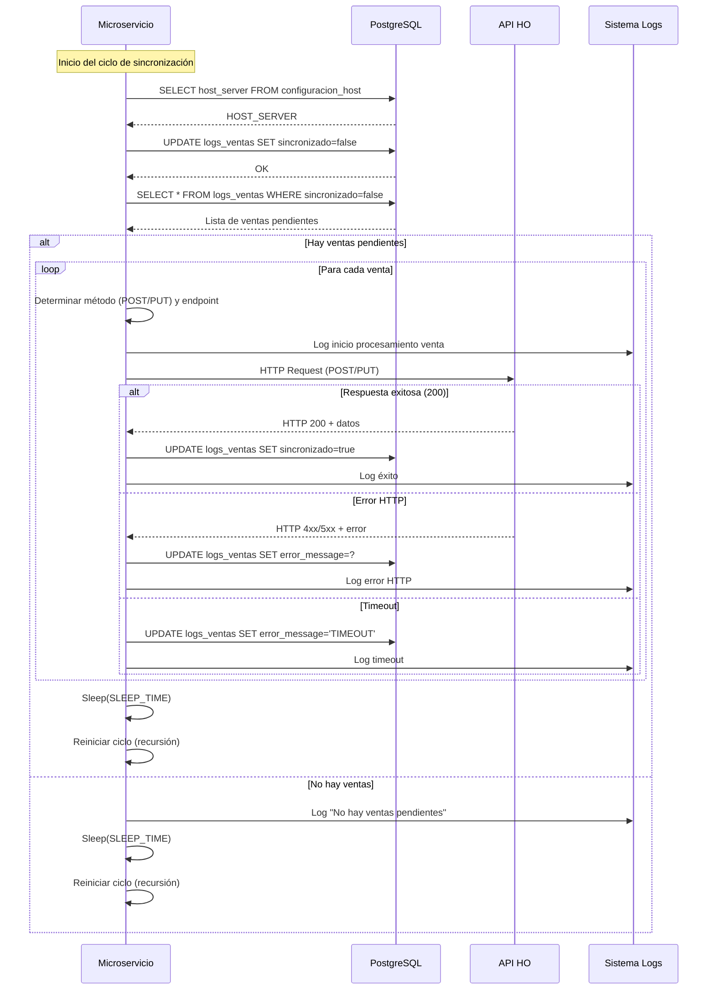
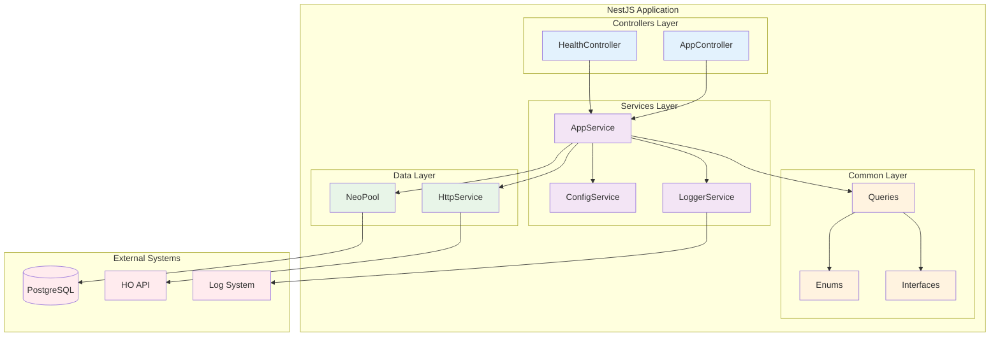
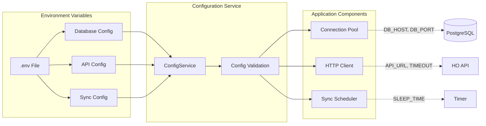
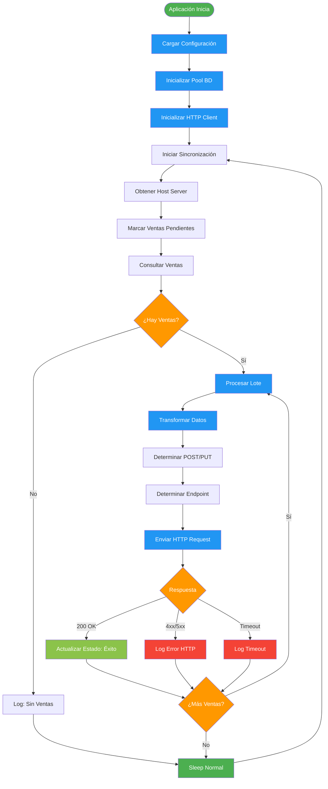
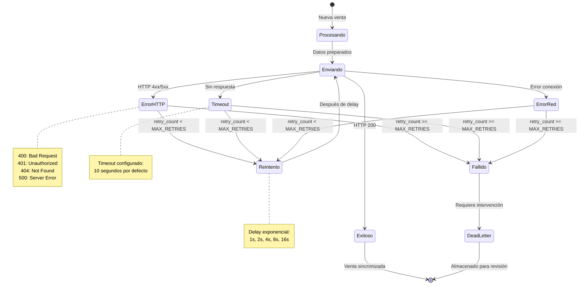
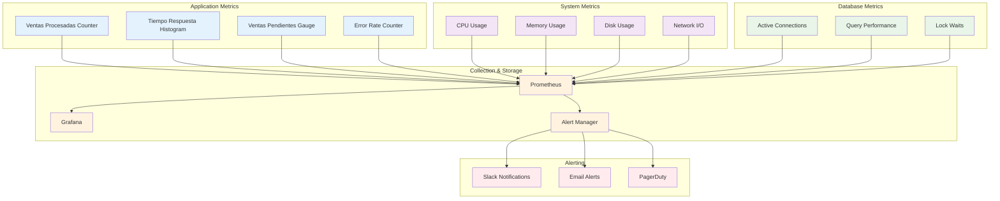
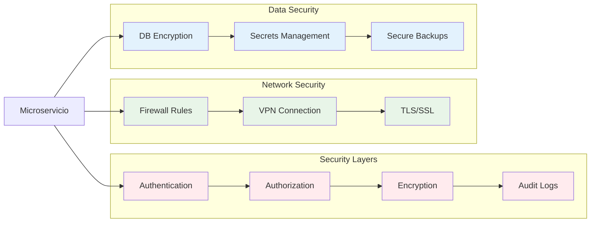

# Diagramas Técnicos Detallados - MS POS Sincronización Sales

## 🗄️ Diagrama de Base de Datos Detallado

## 🔄 Diagrama de Secuencia Detallado

## 🏗️ Diagrama de Componentes Técnicos

## 🔧 Diagrama de Configuración y Variables

## 📊 Diagrama de Flujo de Datos

## 🚨 Diagrama de Manejo de Errores

## 🔍 Diagrama de Monitoreo y Observabilidad

## 🔐 Diagrama de Seguridad y Autenticación

---

**Nota**: Estos diagramas técnicos detallados complementan la documentación principal y pueden ser renderizados usando herramientas compatibles con Mermaid.
